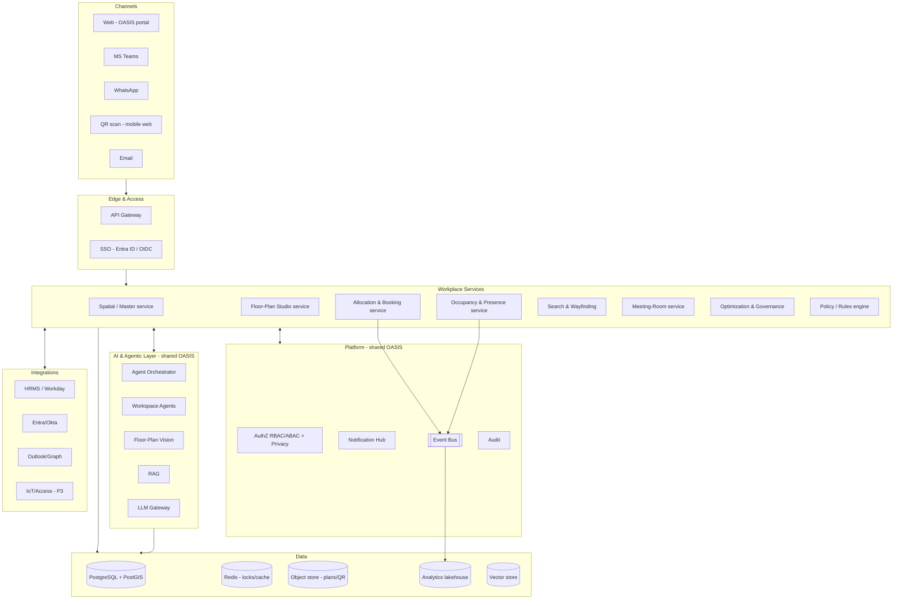
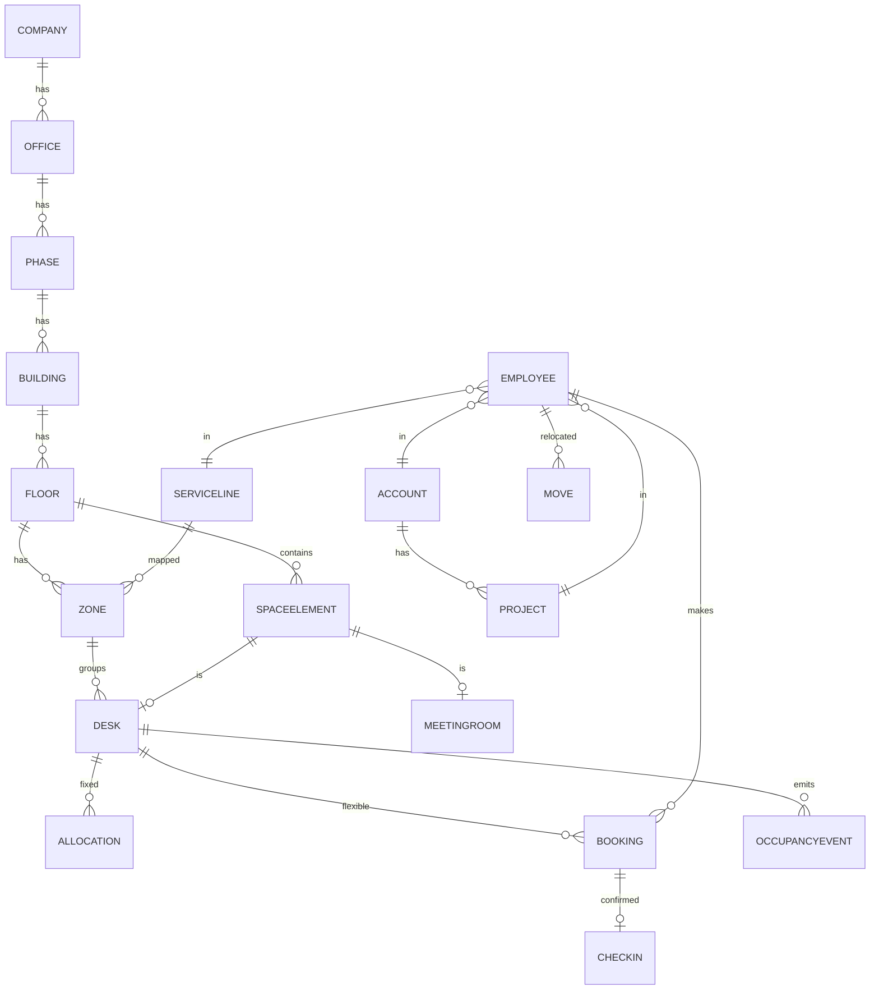

# OASIS — Workplace Intelligence & Digital Workplace Platform

### Implementation Plan & Solution Design (for review)

**Parent BRD:** [implementation_plan.md](implementation_plan.md) — this is **Module 3 (Smart Workspace Management) expanded** into a full sub-platform. Reuses the OASIS platform core (SSO, RBAC/ABAC, event bus, RAG, notification hub, agent orchestrator, dashboards).
**Source requirement:** `Workplace Intelligence Requirement.docx` (27 modules + AI agents + future roadmap).
**Version:** 0.1 (Draft for Review) · **Date:** 2026-06-05 · **Status:** Pending stakeholder review · **Classification:** Internal — Confidential
**Author:** Solution / Product / AI / UX Architect & Engineering Lead

> **What this is:** a reviewable implementation plan — architecture, capability map, data model, AI agents, floor-plan engine, security/privacy, dashboards, phasing, test & rollout, plus my **architect's review of the requirement** (what to keep, consolidate, sequence, and do better). **Nothing is built yet** — we lock scope after your review, then build phase-wise with mock data (same approach as Invoicing & Travel Desk).

---

## 1. Executive Summary

A cloud-native, **AI-first Workplace Intelligence platform** that replaces manual Excel/static-floor-plan/email desk management with: an **interactive floor-plan** (movie-seat-style allocation & booking), **fixed + hybrid hot-desking**, **QR desk operations**, **occupancy & presence tracking**, **search/wayfinding**, **meeting-room intelligence**, and an **AI/analytics layer** (planning, heatmaps, forecasting, cost optimization, team-seating, relocation, governance) surfaced through **dashboards** and a **role-aware conversational copilot** (Web/Teams/WhatsApp).

The requirement itself nails the core thesis: *the enterprise value is Intelligence + Occupancy Analytics + Collaboration + Cost Optimization + AI workforce planning — not just desk booking.* The plan below keeps that ambition but makes it **buildable and safe** through consolidation, phasing, and privacy governance.

**Target outcomes:** desk-utilisation visibility (real-time, service-line-wise) · ≥ X% space-cost reduction via consolidation · self-service booking adoption · admin effort ↓ · zero double-bookings · privacy-compliant location intelligence.

---

## 2. Architect's Review — keep / consolidate / sequence / do better

> You asked specifically for this. The requirement is excellent and comprehensive; my job is to make it **enterprise-grade *and* deliverable**.

### 2.1 Consolidate 27 modules → ~10 capability domains
The 27 modules overlap heavily. Building 27 "modules" invites duplication, inconsistent data, and a multi-year build. I recommend **10 coherent domains** (§5 maps every module). The biggest redundancies:
- **Four conversational variants** — AI Chatbot, AI Executive Copilot, Executive Command Center (M23), Workplace Copilot (M24) — are **one** role-aware **Conversational AI layer** over the same data (reuses the OASIS chatbot/orchestrator from BRD Module 7). Build once, with personas (employee vs executive) and RAG.
- **Occupancy (M8) + Heatmaps (M12) + Demand Forecasting (M18) + Analytics Data Lake (M26) + Dashboards + Sustainability (M22)** = **one Occupancy & Analytics domain** (ingest → store → analyze → forecast → visualize).
- **Team Seating (M11) + Collaboration Intelligence (M16)** = **one collaboration-aware seating capability** (with privacy guardrails — see §2.4).
- **Relocation (M13) + Priority (M17) + Cost (M15) + Governance (M25) + Optimization Engine** = **one Optimization & Governance domain** driven by a **policy/rules engine** + the analytics layer.
- The **7 "specialized agents"** aren't separate apps — they're **capabilities behind the shared orchestrator** (good design, matches BRD §8).

### 2.2 Phase aggressively — don't boil the ocean
The platform spans a quick-win MVP to multi-year R&D (digital twin, AR, IoT, face-recognition). Sequencing (detail in §17):
- **MVP (the product's spine):** Masters + Spatial model → **Floor-Plan Studio (manual)** → Allocation + Booking + QR → Occupancy/check-in → Search/highlight → core Dashboard. This alone retires the Excel/manual process and is demoable in weeks.
- **Phase 2 — Intelligence:** heatmaps, forecasting, team-seating, relocation planner, cost optimization, governance, conversational copilot, meeting-room + Outlook.
- **Phase 3 — Premium/R&D:** Digital Twin (2D→3D), AR navigation, **IoT sensors / biometric / face-recognition presence**, advanced sustainability.

### 2.3 The genuinely hard / risky parts (de-risk early, set expectations)
- **AI floor-plan auto-extraction from CAD/PDF/Visio (M3 / AI Floor-Plan Generator) is the #1 technical risk.** Robust auto-detection of desks/rooms/doors from arbitrary CAD/Visio/scanned PDFs is an R&D-grade computer-vision problem with unreliable accuracy. **Recommendation:** ship the **manual drag-drop designer first** + **import the layout as a background image/PDF to trace over** + **AI-*assisted* tagging** (human confirms). Treat full auto-generation as a **later, opt-in** track with a confidence + human-in-the-loop review — never trust it blind. (Mirrors how we treated AI invoice extraction.)
- **Floor-plan rendering at scale** — thousands of desks per floor, smooth zoom/pan → needs a performant canvas/SVG engine with virtualization/level-of-detail. Architect this as a reusable component from day one (it's the product's signature UX).
- **Booking concurrency** — no double-booking under load → DB-level constraints + transactional holds + idempotent QR actions.
- **Digital Twin / 3D / AR / IoT** — high cost, low day-1 ROI. Keep firmly in Phase 3; don't let it distort the MVP.

### 2.4 Do it better — **privacy & employee-monitoring governance (most important gap)**
"Where is John sitting?", collaboration graphs (M16), attendance correlation (M19), face-recognition (roadmap) make this a **people-tracking system handling sensitive personal data**. The spec under-addresses the legal/ethical side. Enterprise-grade **must** add:
- **Purpose limitation & DPIA** before build; **GDPR / India DPDP / works-council** review (mandatory in EU offices).
- **Role-scoped visibility:** employees should *not* freely locate any colleague. Default to **team/project-scoped** "find a colleague," with an **opt-out / privacy mode**; full directory-location is an admin/facility privilege.
- **Aggregation thresholds** on heatmaps/analytics (e.g., never show occupancy for a group < N) to prevent de-anonymisation.
- **Collaboration & attendance analytics = opt-in / aggregated**, positioned as *space planning*, never individual performance monitoring (explicitly exclude from HR/appraisal use).
- **Full audit** of who viewed/located whom. This protects Opus legally and is a genuine differentiator.

### 2.5 Other "do-it-better" recommendations
- **Single source of truth = the spatial model** (floor geometry + desk inventory). Allocation, booking, occupancy, heatmaps, search-highlight all read/write the *same* desk objects — no parallel spreadsheets.
- **Config-driven policy/rules engine** for booking priority (M17), governance (M25), capacity/zone rules — not hardcoded `CEO=1`. Lets facility admins change rules without redeploys.
- **Event-driven occupancy** — every book/check-in/no-show/QR-scan emits an event → analytics, notifications, governance, data lake all subscribe (one pipeline, many consumers).
- **Meeting rooms (M10)** — integrate with the **existing calendar (Outlook/Graph)** rather than building a parallel scheduler; OASIS owns the floor-plan view + capacity/equipment metadata.
- **Reuse OASIS platform** — SSO/Entra, RBAC/ABAC, notification hub, RAG, agent orchestrator, dashboard framework already exist in the BRD. The Workplace module **plugs in**, not rebuilds.
- **"Designed for 100k, validated for 1,000s"** — architect for global multi-office scale (partition by office/tenant, async occupancy writes), but build/tune against Opus's real ~1,000-employee, few-office reality first.

---

## 3. Scope

### In scope (the platform)
Spatial masters & org hierarchy · Floor-Plan Studio (manual + assisted import) · fixed allocation + flexible/shared/reserved booking · QR desk ops · occupancy/presence & no-show · search/wayfinding · meeting-room intelligence · service-line zones · neighborhood/team seating · heatmaps · forecasting · relocation & cost optimization · governance · dashboards & reports · conversational copilot · integrations (HRMS/AD/Teams/WhatsApp/calendar) · security/privacy.

### Out of scope (initially) / Phase 3+
Digital twin & 3D/AR · IoT sensor presence, biometric & face-recognition check-in · parking & visitor-vehicle · smart-building/energy hardware. (Designed-for, not built-now.)

### Boundary
HRMS/Identity remain systems of record (OASIS **integrates**). Access-control/biometric data is **read-only correlation** (Phase 3) under strict privacy controls — OASIS does not run physical security.

---

## 4. Personas & Roles

| Persona | Needs | Notes |
|---|---|---|
| **Employee** | Book/cancel/extend desk, find my desk, sit near team, QR check-in, find a colleague (scoped) | Highest volume; web + Teams/WhatsApp + QR |
| **Facility / Workspace Manager** | Floor-plan design, allocation/relocation, zones, occupancy, utilization, moves | Primary admin user |
| **Admin** | Masters, employee import, QR generation, overrides | |
| **Service-Line / Account Lead** | Their team's seating, zone capacity, allocation reports | Scoped (ABAC) |
| **Executive / CXO** | Occupancy, utilization, cost, consolidation insights | Conversational + dashboards |
| **Auditor** | Audit logs, policy compliance, who-viewed-whom | Read-only |
| **Super Admin / System Admin** | RBAC/ABAC, integrations, policy engine, multi-office config | |
| **Visitor / Contractor** | Temporary desk (sponsored) | Phase 2 (M14) |

**Access model:** RBAC + ABAC (office/region, service line, account, project, grade) enforced at API & data layers; **privacy scoping** on people-location (§2.4).

---

## 5. Module → Capability-Domain Map (all 27 covered)

| # | Domain | Source modules folded in |
|---|---|---|
| **D1** | **Workspace Master & Spatial Model** | M1 (masters), M5 (zones), org hierarchy, status lifecycle |
| **D2** | **Floor-Plan Studio** (manual designer + assisted import + AI vision) | M3, AI Floor-Plan Generator |
| **D3** | **Allocation & Booking** (fixed/flexible/shared/reserved + QR + priority + visitor) | M4, M6, M7, M17, M14 |
| **D4** | **Occupancy & Presence** (check-in, no-show, attendance correlation) | M8, M19 |
| **D5** | **Search & Wayfinding + Meeting Rooms** | M9, M10 |
| **D6** | **Workspace Intelligence & Analytics** (heatmaps, forecasting, data lake, dashboards, sustainability) | M8/M12/M18/M22/M26 + Dashboards |
| **D7** | **Collaboration-Aware Seating** (team/manager/project proximity) | M11, M16 |
| **D8** | **Optimization & Governance** (relocation, cost, policy, governance) | M13, M15, M25, AI Optimization Engine |
| **D9** | **Conversational & Executive AI + Notifications** | AI Chatbot, Exec Copilot, M23, M24, M20 |
| **D10** | **Platform, Identity & Integration Hub** | M2 (employee master), M27, Security, AI agents host |
| **P3** | **Premium/R&D** (Digital Twin, 3D/AR, IoT/biometric) | M21, Future Roadmap |

---

## 6. Enterprise Architecture

- **Modular services** behind the gateway (start as a well-bounded modular monolith within OASIS; extract Booking/Occupancy first as they're highest-throughput).
- **PostGIS** (geospatial Postgres) for floor geometry & desk coordinates → enables "highlight on plan", proximity (sit-near), zone containment, heatmap aggregation.
- **Event-driven** occupancy/booking → analytics, notifications, governance, data lake.
- **AI layer is shared** OASIS infra; Workplace adds agents + a Floor-Plan Vision service.

---

## 7. The Floor-Plan Engine (product centerpiece)

The signature UX (movie-seat/airline-seat selection). Three pillars:

1. **Manual Floor-Plan Studio** (build first) — drag-drop palette (Desk, Cabin, Cubicle, Meeting Room, Door, Exit, Pillar, Cafeteria, Reception, Utility, Open Space); zoom/pan/minimap/grid-snap; assign desk numbers, zones, service-line colour, status (Active/Inactive/Maintenance). Import an existing plan **as a background image/PDF to trace over**.
2. **Assisted import** (Phase 2) — upload PDF/Image/CAD/Visio/Excel → **AI vision proposes** desks/rooms/doors/pathways → **human reviews & corrects** (confidence-scored, never blind-trusted). Excel layout → grid mapping is the easiest; raster/CAD is hardest (§2.3).
3. **Interactive runtime** — the same geometry powers allocation, booking, occupancy overlay, heatmap overlay, search-highlight, and (P3) 3D/digital-twin. Rendering via performant **canvas/SVG (Konva/PixiJS)** with virtualization for large floors.

**Data:** each element is a geometry object (type, x/y/rotation/size, floor, zone, deskNo, status) in PostGIS — one model, many overlays.

---

## 8. AI & Agentic Design (behind the shared orchestrator)

| Agent (capability) | Purpose | HITL |
|---|---|---|
| **Floor-Plan Vision** | Detect desks/rooms/doors from image/PDF/CAD → editable layout | **Review-gated** |
| **Workspace Planning** | Best seating; service-line/account/project clustering; collaboration optimisation | Suggest |
| **Occupancy Intelligence** | Utilisation, busy/low periods, anomalies | Alerts |
| **Demand Forecasting** | Predict occupancy by day/floor (historical trends) | Read |
| **Team-Seating Assistant** | "Sit near team/manager/project" recommendations at booking | Suggest (privacy-scoped) |
| **Relocation Planning** | Move plan, employee↔desk mapping, schedule, comms | Plan → human approves |
| **Cost Optimization** | Cost/desk/employee/floor/SL; consolidation savings | Recommend |
| **Governance** | No-show patterns, booking abuse, capacity breaches → recommendations | Alerts/gate |
| **Executive Analytics / Copilot** | NL Q&A + report generation over workspace data (RAG) | Read |
| **Employee Assistance** | Conversational booking/cancel/find (Teams/WhatsApp/Web) | Confirm actions |

Model routing per BRD §8.6 (frontier model for planning/vision reasoning; fast/cheap for chat/classification). RAG over: floor plans, seating, policies, utilisation history.

---

## 9. Data Model (key entities)

**Core entities:** Company, Office, Phase, Building, Floor, Zone, **SpaceElement** (geometry: desk/cabin/room/door/…), Desk (mode: fixed/flexible/shared/reserved; status), MeetingRoom (capacity/equipment), ServiceLine, Account, Project, Employee, Allocation (fixed), Booking (type: hourly/half/full/multi-day; states), CheckIn, OccupancyEvent, NoShow, Move/Relocation, Visitor, Policy/Rule, AuditLog, QRCode, NotificationLog. Plus a **lakehouse** for historical analytics (M26).

**Desk lifecycle:** `Available → Held → Booked → Checked-In → Occupied → Released` (+ `No-Show → auto-release`, `Maintenance`, `Reserved`).
**Booking lifecycle:** `Draft → Confirmed → (Checked-In | No-Show) → Completed | Cancelled | Extended`.

---

## 10. Booking & Occupancy Engine
- **Allocation modes:** Fixed (permanent), Flexible (employee-bookable), Shared (multi-employee/shift), Reserved (special).
- **Booking:** hourly/half/full/multi-day; configurable booking window (15/30/60 days); modify/cancel/extend; **priority engine** (policy-driven) for contention.
- **QR ops:** each desk has a unique QR → book / confirm arrival / modify / cancel / view. **Arrival confirm restricted to booking owner** (admin override, audited).
- **Occupancy states:** Booked · Checked-In · Vacant · Occupied · No-Show. No-show → alerts + auto-release + governance escalation on repeat.
- **Concurrency:** unique partial index on (desk, time-range) + Redis hold locks + idempotent QR endpoints → zero double-booking.
- **Everything emits events** → analytics/notifications/governance/data-lake.

---

## 11. Security, Privacy & Compliance
- **AuthN:** SSO via Entra ID/OIDC + MFA. **AuthZ:** RBAC (roles in §4) + ABAC (office/SL/account/project/grade).
- **Privacy (§2.4 — mandatory):** DPIA; purpose limitation; **role-scoped people-location** (team/project default, opt-out/privacy mode); **aggregation thresholds** on analytics; collaboration/attendance analytics **opt-in & aggregated, excluded from HR appraisal**; **who-viewed-whom audit**.
- **Data protection:** encryption in transit/at rest; PII (employee, location, biometric-P3) classified Restricted; biometric/face (P3) needs explicit consent + separate legal sign-off.
- **Audit:** immutable logs for allocations, overrides, location lookups, policy changes, agent actions.

---

## 12. UI / UX — key screens
1. **Floor-Plan Studio** (designer) — palette, zoom/pan/minimap/grid-snap, element properties, zone colouring.
2. **Interactive Floor View** — seat-map: available/booked/blocked/mine/maintenance; filter by floor/zone/service-line/amenities; click desk → allocate/book/details; occupancy & heatmap overlays.
3. **Book a desk** (employee) — date/time/type, **sit-near-team** suggestions, confirm → QR/itinerary.
4. **Admin allocation/relocation** — assign/relocate/reserve from the plan; bulk.
5. **Search & Wayfinding** — find employee/team/account/project/desk → highlight on plan.
6. **Meeting rooms** — capacity/equipment/availability on the plan (+ Outlook).
7. **Occupancy & Heatmap** — live + daily/weekly/monthly/quarterly.
8. **Executive Dashboard** — capacity/occupied/vacant/booked/checked-in/no-show by org→office→floor→zone→SL→account→project.
9. **Relocation planner / Cost optimization / Governance** consoles.
10. **Conversational Copilot** (Web/Teams/WhatsApp).
11. **Masters & Employee import**, **Policy/Rules**, **QR management**, **Settings/Integrations**.

---

## 13. Dashboards & Analytics
KPIs: Total capacity · Occupied · Vacant · Booked · Checked-In · No-Shows — sliced org→office→floor→zone→service-line→account→project.
Reports: Utilisation % · Booking & occupancy trends · No-show analysis · **Desk heat maps** · Service-line/account/project allocation · Cost per desk/employee/floor/SL · Consolidation opportunities · Sustainability (P3). Scheduled delivery (reuse Invoicing's report scheduler). Backed by the **analytics lakehouse (M26)** for history & forecasting.

---

## 14. Integrations
HRMS (Workday/SuccessFactors/BambooHR) — employee master, auto-release on exit · Identity (Entra/Okta) — SSO · Comms (Teams/Slack/WhatsApp) — booking & notifications · Calendar (Outlook/Google) — meeting rooms · Access-control/biometric/RFID & IoT sensors — presence (Phase 3, privacy-gated). **Integration Hub** (M27) with anti-corruption adapters, idempotent webhooks, secrets vault.

---

## 15. Non-Functional Requirements & Scale
- **Scale:** designed for 100k+ employees, many offices globally; partition by office/tenant; async occupancy writes; CDN + cached floor plans.
- **Floor-plan rendering:** smooth at thousands of elements (virtualization/LOD).
- **Availability** 99.9% core; **latency** booking p95 < 500ms, plan load < 2s; **throughput** peak morning check-in bursts.
- **Resilience** RTO ≤ 4h / RPO ≤ 15min; **a11y** WCAG 2.1 AA; multi-timezone/locale/currency.

## 16. Technology Stack (aligned to BRD §17)
Frontend **Next.js + TypeScript** with a **Konva/PixiJS** floor-plan canvas · core services **Java 21 + Spring Boot** · AI services **Python + FastAPI** (LangGraph agents, vision for floor-plan) · **PostgreSQL + PostGIS**, Redis, object storage, vector store, lakehouse · event bus (Kafka/Service Bus) · Entra ID SSO · notification hub (Email/Teams/WhatsApp) · containers/AKS, Terraform, observability + LLM tracing.

---

## 17. Phased Delivery Plan

| Phase | Scope | Exit criteria |
|---|---|---|
| **P0 — Discovery (~2–3 wks)** | Floor-plan data audit, HRMS/AD integration discovery, **DPIA / privacy sign-off**, scale targets, pick floor-plan canvas lib | Architecture + privacy approach signed off |
| **P1 — MVP spine (~8–10 wks)** | D1 masters + spatial model · **D2 manual Floor-Plan Studio** · D3 allocation + booking + QR · D4 occupancy/check-in/no-show · D5 search/highlight · core dashboard · employee import | Employees book via web + QR; admins allocate on the plan; live occupancy + utilisation dashboard; Excel retired |
| **P2 — Intelligence (~8–10 wks)** | D6 heatmaps/forecasting/lakehouse · D7 team-seating · D8 relocation/cost/governance + policy engine · D9 conversational copilot + notifications · D5 meeting rooms + Outlook · assisted floor-plan import · Teams/WhatsApp | AI seating + heatmaps + forecasting live; copilot answers & books; relocation/cost insights |
| **P3 — Premium/R&D** | M21 Digital Twin (2D→3D) · AR navigation · IoT/biometric/face presence · advanced sustainability · visitor/parking | Pilot per capability with separate ROI/legal gates |

(Frontend-first with mock data per phase — same method as Invoicing & Travel Desk — then backend services.)

## 18. Test Strategy
Unit + integration (booking concurrency, no double-book, QR idempotency) · floor-plan rendering/perf tests at scale · **AI evals** (floor-plan vision precision/recall with human-review gate; forecasting accuracy/MAPE; copilot task success) · security (RBAC/ABAC, privacy-scope enforcement, pen-test) · accessibility · UAT per persona.

## 19. Rollout Strategy
Pilot **one office / one floor** → validate floor-plan accuracy + booking + occupancy → expand floor-by-floor/office-by-office (feature-flagged) · change management & training (employees + facility managers) · run **manual + OASIS in parallel** briefly · privacy comms to employees (what's tracked, why, opt-outs).

## 20. Risks & Mitigations
| Risk | Mitigation |
|---|---|
| AI floor-plan extraction unreliable | Manual designer first; assisted + human-review; image-trace fallback |
| **Privacy / works-council pushback** | DPIA, role-scoped visibility, opt-out, aggregation thresholds, no HR-appraisal use |
| Scope creep (27 modules) | Domain consolidation + strict phasing; MVP spine first |
| Double-booking / race conditions | DB constraints + Redis holds + idempotent QR |
| Floor-plan perf at scale | Canvas virtualization/LOD; cache plans |
| Adoption | Quick-win MVP, great seat-map UX, Teams/WhatsApp/QR convenience |
| IoT/biometric cost & legality | Phase 3, separate ROI + consent + legal gate |

## 21. Open Decisions
| # | Decision | Recommendation |
|---|---|---|
| W1 | Floor-plan canvas library | **Konva** (2D, productive) → evaluate PixiJS/three.js for P3 3D |
| W2 | Floor-plan import scope for P1 | **Background-image trace + manual**; AI auto-detect = P2 opt-in |
| W3 | People-location default visibility | **Team/project-scoped + opt-out** (privacy-first) |
| W4 | Meeting rooms: build vs Outlook | **Integrate Outlook/Graph**; OASIS owns plan + metadata |
| W5 | Geospatial in Postgres (PostGIS) vs JSON geometry | **PostGIS** for proximity/containment/heatmaps |
| W6 | Presence source for occupancy | P1 **QR/manual check-in**; IoT/biometric P3 (privacy-gated) |
| W7 | Build order vs other OASIS modules | Slot after Travel Desk; share platform core |

## 22. KPIs
Desk/space utilisation % · booking adoption & self-service rate · no-show % ↓ · admin effort ↓ · space-cost reduction (consolidation ₹) · forecast accuracy · search→find time · copilot deflection/task success · **zero double-bookings · zero privacy incidents**.

## 23. Glossary
**Hot-desk** shared bookable desk · **Zone** colour-coded service-line area · **Neighborhood** cluster of desks for a team · **Occupancy** booked vs actually present · **No-show** booked, never checked-in · **Digital Twin** live virtual replica of the office · **PostGIS** geospatial Postgres · **DPIA** Data Protection Impact Assessment · **ABAC** attribute-based access control.

---

*End of Workplace Intelligence implementation plan v0.1 (Draft for Review). On your sign-off — especially scope (§3), domain consolidation (§2.1/§5), privacy approach (§2.4/§11), and the open decisions (§21) — we lock it and build phase-wise (MVP spine first), the same way we did Invoicing and Travel Desk.*
