# OASIS — Implementation Plan
### Opus Administration & Service Intelligence Suite
**An Enterprise-Grade, AI-Powered Administration Management Platform for Opus Technologies**

---

## Document Control

| Field | Value |
|---|---|
| **Document** | OASIS — Enterprise Implementation Plan |
| **Version** | 1.0 (Draft for Review) |
| **Date** | 2026-06-03 |
| **Prepared by** | Solution & Design Architect (AI / RAG / Cloud) |
| **Audience** | Admin Dept. Leadership, IT, Finance, Security, Executive Sponsors |
| **Status** | Draft — pending stakeholder review |
| **Classification** | Internal — Confidential |

---

## Table of Contents

1. [Executive Summary](#1-executive-summary)
2. [Business Context & Objectives](#2-business-context--objectives)
3. [Current State Analysis & Pain Points](#3-current-state-analysis--pain-points)
4. [Solution Vision & Guiding Principles](#4-solution-vision--guiding-principles)
5. [Scope](#5-scope)
6. [Personas & Roles](#6-personas--roles)
7. [Enterprise Architecture](#7-enterprise-architecture)
8. [AI & Agentic Architecture](#8-ai--agentic-architecture)
9. [Module-wise Design](#9-module-wise-design)
10. [Data Architecture & Data Model](#10-data-architecture--data-model)
11. [Integration Architecture](#11-integration-architecture)
12. [API Strategy](#12-api-strategy)
13. [Security, Privacy, Compliance & Governance](#13-security-privacy-compliance--governance)
14. [Cloud & Infrastructure Architecture](#14-cloud--infrastructure-architecture)
15. [DevOps, CI/CD & Observability](#15-devops-cicd--observability)
16. [Non-Functional Requirements](#16-non-functional-requirements)
17. [Technology Stack Summary](#17-technology-stack-summary)
18. [Implementation Roadmap & Phasing](#18-implementation-roadmap--phasing)
19. [Team Structure & RACI](#19-team-structure--raci)
20. [Cost Estimation](#20-cost-estimation)
21. [ROI Analysis](#21-roi-analysis)
22. [Risks & Mitigations](#22-risks--mitigations)
23. [Assumptions & Open Decisions](#23-assumptions--open-decisions)
24. [Future Enhancements](#24-future-enhancements)
25. [Appendix](#25-appendix)

---

## 1. Executive Summary

**OASIS** is a cloud-native, AI-powered platform that centralises and automates the full range of activities run by the Opus Technologies Administration department — Procurement, Facilities & Asset Management, Workspace/Desk Management, Travel Desk, Invoice & Payment reconciliation, Visa assistance, Events, and an Admin Helpdesk — exposed through a single web portal, mobile/PWA, an omnichannel chatbot, and WhatsApp/Teams integrations, and surfaced to all employees via the existing **Opus Sync** portal.

The platform pairs conventional enterprise application engineering (workflows, RBAC, dashboards, integrations) with a **multi-agent AI layer** (LLM + RAG + tool-using agents) that performs the heavy, repetitive cognitive work the 4–5 person admin team does today: market research, vendor comparison, quote normalisation, stock forecasting, contract-expiry tracking, invoice/UTR matching, and conversational self-service.

**Target outcomes**

| Outcome | Target |
|---|---|
| Reduction in manual admin effort | ≥ 60% on automated workflows |
| Procurement cycle time (request → PO) | −50% |
| Travel quote turnaround | Hours → minutes (near real-time options) |
| Invoice-to-payment reconciliation accuracy | ≥ 99% auto-match |
| Desk/workspace utilisation visibility | Real-time, service-line-wise |
| Employee self-service deflection (chatbot) | ≥ 50% of routine admin queries |

**Recommended delivery approach:** A foundation-first, phased rollout over ~9–12 months — establish the platform core (identity, data, workflow, RAG, notification, dashboards) in Phase 0/1, then ship modules in value-ordered increments, each independently usable.

> **Two items require early governance decisions** (detailed in §22–23): (a) the **Visa appointment-slot** use case must follow a *notification-only, Terms-of-Service-compliant, human-in-the-loop* design — automated slot grabbing/anti-bot evasion is out of scope; and (b) **Travel search** must use licensed travel APIs/GDS/aggregators rather than scraping consumer booking sites.

---

## 2. Business Context & Objectives

**Organisation:** Opus Technologies — mid-sized global IT services company, 1000+ employees, multiple offices worldwide, centralised Administration department (4–5 members) running a wide span of functions, today largely on **email + spreadsheets + manual coordination**.

**Existing landscape:** **Opus Sync** employee portal is the intended entry point; OASIS will be linked from and integrate with it (SSO + deep links + embedded widgets).

### Business Objectives

| # | Objective | Success Indicator |
|---|---|---|
| O1 | Centralise all admin functions into one system of record | Single portal; spreadsheets retired |
| O2 | Automate repetitive, manual tasks via AI agents | ≥60% effort reduction |
| O3 | Provide data-driven decision support (procurement, travel, space) | Recommendation acceptance rate, cost savings |
| O4 | Improve compliance, auditability, and governance | 100% audit trail; policy-enforced workflows |
| O5 | Deliver self-service to 1000+ employees | Chatbot deflection ≥50% |
| O6 | Establish a scalable, secure, multi-region foundation | NFR SLAs met; ready for new modules |

---

## 3. Current State Analysis & Pain Points

| Function | Current State | Pain Points | OASIS Opportunity |
|---|---|---|---|
| **Procurement** | Email RFQs, manual web search, spreadsheet comparisons | Slow, inconsistent vendor selection, no history reuse | AI market research, normalized multi-factor scoring, recommendation + approval workflow |
| **Administration/Facilities** | Manual consumable & AMC tracking in sheets | Stock-outs, missed AMC renewals, reactive | Inventory forecasting, automated low-stock & expiry alerts |
| **Workspace** | Limited/no real-time desk view; ad-hoc allocation | No utilisation insight; hybrid chaos | Visual desk booking, occupancy heatmaps, service-line utilisation |
| **Travel** | Multiple agents emailed; manual quote comparison + own searches | Hours of turnaround, manual normalisation, no fare monitoring | AI travel agent: aggregate + normalise + recommend; fare/schedule alerts |
| **Invoicing** | Finance shares records; manual UTR matching | Error-prone, delayed status updates | OCR ingestion + automated invoice↔UTR reconciliation |
| **Visa** | Manual portal checking for appointment slots | Time-consuming, slots missed | *Compliant* slot-availability monitoring + notifications + doc guidance |
| **Cross-cutting** | Phone/email/walk-up requests to admin team | Repetitive Q&A, no knowledge base | RAG chatbot across all services, omnichannel |

**Root causes:** fragmented tooling, no single data model, no automation of cognitive tasks (search/compare/match), and no analytics layer.

---

## 4. Solution Vision & Guiding Principles

> **Vision:** *"A single intelligent front door for every administrative need at Opus — where employees self-serve in natural language, and the admin team supervises AI agents instead of doing manual busywork."*

### Architecture Tenets

1. **API-first & modular monolith → microservices**: start as a well-bounded modular system; extract services as scale demands. Each module owns its data and exposes APIs.
2. **AI as an augmentation layer, not a black box**: agents propose; humans approve for material/financial/legal actions (human-in-the-loop by default).
3. **RAG over fine-tuning**: ground answers in Opus's own policies, catalogs, vendor history, and contracts; keep knowledge fresh without retraining.
4. **Event-driven**: state changes emit events → notifications, analytics, and downstream automation.
5. **Composable agents with tools (MCP)**: agents call typed tools/APIs; no free-form side effects.
6. **Security & privacy by design**: RBAC/ABAC, least privilege, PII protection, full audit trail.
7. **Cloud-native, multi-region ready**: containers, managed services, IaC, observability.
8. **Responsible & compliant AI**: guardrails, evaluation, ToS/legal compliance (esp. Visa & Travel).
9. **Progressive delivery**: every phase ships independently usable value.

---

## 5. Scope

### In Scope
- 7 core modules (Procurement, Admin/Facilities, Workspace, Travel, Invoicing, Visa, Chatbot).
- Platform foundation: identity/SSO, RBAC, workflow engine, RAG/knowledge base, notification hub, analytics/dashboards, audit.
- Channels: Web portal (via Opus Sync), Mobile/PWA, WhatsApp, MS Teams, Slack, Email.
- Enhancement modules (recommended): Events Management, Admin Helpdesk/Ticketing, Asset Lifecycle, Vendor & Contract Lifecycle (CLM), Visitor Management, Spend Analytics.

### Out of Scope (initially)
- Replacing Finance ERP / HRMS (OASIS **integrates**, does not replace).
- Direct automated booking that violates third-party Terms of Service (visa slot auto-booking, consumer-site scraping).
- Payroll, performance management, core HR.

---

## 6. Personas & Roles

| Persona | Needs | Key Modules |
|---|---|---|
| **Employee (1000+)** | Self-service: book desk, raise procurement/travel/facility request, check invoice/visa status, ask questions | Chatbot, Workspace, Travel, Procurement (request) |
| **Admin Officer** | Process requests, supervise agents, manage inventory/AMC/events | All |
| **Procurement Officer** | Vendor discovery, comparison, PO, approvals | Procurement, Vendor/CLM |
| **Travel Desk Officer** | Compare quotes, book, monitor fares/schedules | Travel, Visa |
| **Finance Officer** | Invoice records, UTR updates, reconciliation reports | Invoicing |
| **Facilities Manager** | Space planning, utilisation, maintenance | Workspace, Facilities |
| **Department / Service-Line Head** | Approvals, budgets, utilisation reports | Dashboards, approvals |
| **Admin Head / CXO** | KPIs, spend, compliance | Executive dashboards |
| **System Admin** | RBAC, config, integrations, audit | Platform admin |

**Access model:** RBAC + ABAC (attributes: office/region, service line, cost center, employee grade) enforced at API and data layers.

---

## 7. Enterprise Architecture

### 7.1 Logical Layered View

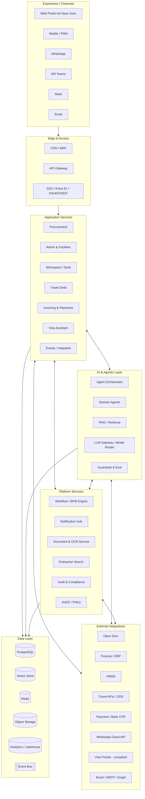

### 7.2 Architecture Style
- **Modular service architecture** behind an **API Gateway**; each module is an independently deployable service (or a bounded context within a modular monolith for Phase 1, extracted later).
- **Event bus** (Kafka / Azure Service Bus) for asynchronous workflows, notifications, and analytics.
- **AI layer is a shared service** consumed by all modules through a stable internal contract (so model/provider can change without touching business code).

---

## 8. AI & Agentic Architecture

### 8.1 Design Principles
- **Orchestrator–worker (supervisor) pattern**: a top-level orchestrator routes a user goal to the right domain agent(s); domain agents use tools and RAG; results are validated by guardrails before action.
- **Tool-using agents over free generation**: every side-effecting capability (search vendor, create PO draft, book desk, send WhatsApp, query invoice) is a **typed tool** exposed via **Model Context Protocol (MCP)** / function-calling. The LLM never writes to systems directly.
- **Human-in-the-loop (HITL)** gates on any action with financial, contractual, legal, or external-booking impact.
- **Model-agnostic via an LLM Gateway / Model Router** — route by task to the best/cheapest capable model; fall back gracefully; cache aggressively.

### 8.2 Multi-Agent Topology

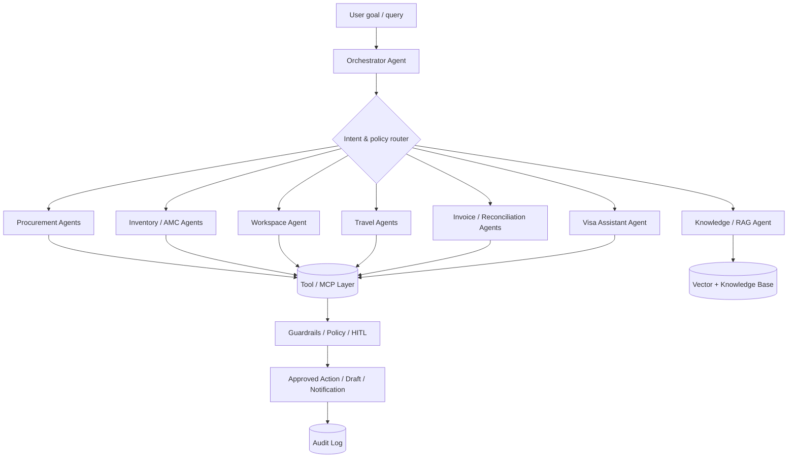

### 8.3 Agent Catalog

| Agent | Purpose | Key Tools | HITL? |
|---|---|---|---|
| **Orchestrator** | Intent detection, routing, multi-step planning, memory | router, all sub-agents | n/a |
| **Procurement Research Agent** | Discover vendors, gather price/warranty/delivery/service data | catalog API, vendor DB, web/commerce APIs | No (read) |
| **Vendor Recommendation Agent** | Multi-factor scoring & comparison report | scoring engine, history DB | No |
| **Cost Optimization Agent** | Budget fit, negotiation hints, bulk/contract suggestions | spend analytics | No |
| **Inventory Prediction Agent** | Consumable demand forecast, reorder points | inventory DB, forecast model | Alerts only |
| **AMC Renewal Agent** | Track contract expiry, renewal reminders & recommendations | contract DB, calendar, notify | Alerts only |
| **Workspace Optimization / Forecast Agent** | Utilisation analysis, allocation suggestions | booking DB, occupancy | No |
| **Flight Search Agent** | Query travel APIs, normalise itineraries | GDS/aggregator APIs | No |
| **Hotel Search Agent** | Query hotel APIs, normalise rates/policies | hotel APIs | No |
| **Quote Comparison Agent** | Normalise & rank agent quotes + portal options | parser, scoring | No |
| **Fare/Schedule Monitoring Agent** | Watch fare drops & schedule changes; alert | price-watch jobs, notify | Alerts only |
| **Travel Compliance Agent** | Policy checks (class, budget, advance), visa needs | policy KB | Gate |
| **Invoice Matching Agent** | OCR extract, match invoice↔PO↔UTR | OCR, finance feed | Confidence-gated |
| **Payment Reconciliation Agent** | Flip status on UTR, flag exceptions | invoice DB, finance API | Gate on exceptions |
| **Visa Assistant Agent** | Doc guidance, *compliant* slot monitoring & notify | KB, monitor (ToS-bound) | Notify only |
| **Knowledge/RAG Agent** | Answer policy/process questions with citations | retriever, KB | No |

### 8.4 RAG Architecture

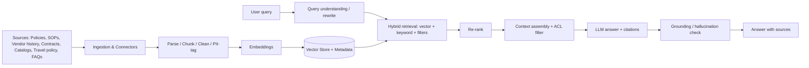

**Key design choices**
- **Hybrid search** (semantic + keyword/BM25 + metadata filters) with a **re-ranker** for precision.
- **Row/document-level ACLs in retrieval** — users only retrieve content they're authorised to see (critical for contracts, finance, visa/PII).
- **Citations mandatory** for knowledge answers; **grounding/hallucination check** before responding.
- **Incremental ingestion** via connectors (SharePoint/Opus Sync docs, contracts repo, vendor master, policy store) with change-data-capture.
- **Evaluation harness**: golden Q&A sets, retrieval recall, answer faithfulness, regression gates in CI.

### 8.5 Knowledge Base Design (domains)
Procurement policy & catalogs · Vendor master & purchase history · AMC/contract repository · Facilities & inventory SOPs · Travel policy & visa rules · Finance/invoice SOPs · HR/admin FAQs · Office/floor maps & seating rules. Each domain is a separately governed collection with owners, refresh cadence, and access policy.

### 8.6 LLM Strategy & Model Routing
- **LLM Gateway** abstracts providers; **route by task**:
  - *Complex reasoning / multi-step agents* → frontier model (e.g., Claude Opus / GPT-class).
  - *High-volume routine (classification, extraction, chat)* → fast/cheaper model (e.g., Claude Sonnet/Haiku-class or small OSS model).
  - *Embeddings* → dedicated embedding model.
  - *OCR/structured extraction* → document-AI service + LLM post-processing.
- **Cost controls**: prompt/response **caching**, semantic cache for chatbot, batching, max-token budgets, and per-tenant usage metering.
- **Deployment**: prefer enterprise-hosted models (Azure OpenAI / Amazon Bedrock / Anthropic API with zero-retention/enterprise terms) so data isn't used for training.

### 8.7 Responsible AI & Guardrails
- Input/output **content filtering**, **PII redaction** before model calls where feasible, **prompt-injection defenses** (especially for tool-using agents on web/email content).
- **Confidence thresholds** drive auto-action vs. human review (e.g., invoice match ≥ threshold auto, else queue).
- **Full traceability**: every agent decision logged with inputs, retrieved context, tool calls, and outputs for audit/explainability.
- **Evaluation & monitoring** of accuracy, drift, and cost in production.

---

## 9. Module-wise Design

> Each module below follows a consistent template: **Objective → Key Features → AI Agents → Primary Workflow → Core Data → Integrations → KPIs.**

### Module 1 — Procurement Intelligence

**Objective:** Turn a purchase need into a data-driven, approved decision in minimal time.

**Key Features**
- Procurement request intake (form + chatbot) with category, specs, budget, urgency.
- **AI market research**: discover suitable vendors/products; gather price, warranty, delivery time, service quality/ratings.
- **Multi-factor comparison & scoring** (weighted: price, warranty, delivery, rating, past performance, compliance).
- Auto-generated **vendor comparison report** & **recommendation scorecard**.
- Historical purchase analysis & reuse of preferred/rate-contract vendors.
- Configurable **approval workflow** (value-based thresholds, multi-level).
- PO draft generation; hand-off/integration to ERP for actual PO.

**AI Agents:** Procurement Research, Vendor Recommendation, Cost Optimization.

**Primary Workflow**
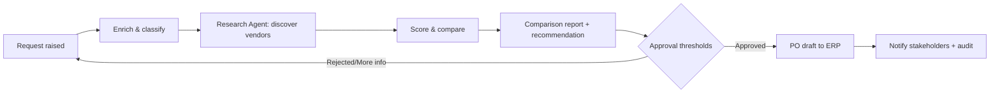

**Core Data:** ProcurementRequest, Vendor, Product/CatalogItem, Quote, ComparisonReport, Recommendation, ApprovalStep, PurchaseOrder.

**Integrations:** Vendor master, ERP (PO), commerce/market data APIs, e-mail for RFQ where needed, spend analytics.

**Data-source note:** Use **licensed commerce/market-data APIs and an internal vendor catalog**; where public web research is used, restrict to ToS-compliant sources/APIs. Keep a curated **preferred-vendor & rate-contract** store to bias recommendations toward negotiated rates.

**KPIs:** Cycle time request→PO, % recommendations accepted, realised cost savings, maverick-spend reduction.

---

### Module 2 — Administration & Facilities Management

**Objective:** Proactive inventory, asset, and AMC management with automated alerts.

**Key Features**
- **Consumable inventory**: stock levels, consumption tracking, reorder points, low-stock **auto-alerts/emails**.
- **Demand forecasting** for consumables (seasonality, headcount, office).
- **Asset register & lifecycle** (assign, transfer, depreciate, retire) — *enhancement*.
- **AMC/contract tracking**: expiry calendar, **renewal reminders ahead of expiry**, renewal/vendor recommendation.
- **Facility requests & maintenance scheduling** (repairs, housekeeping, pantry).
- Maintenance SLA tracking.

**AI Agents:** Inventory Prediction, AMC Renewal, Facility Monitoring.

**Primary Workflow (AMC)**
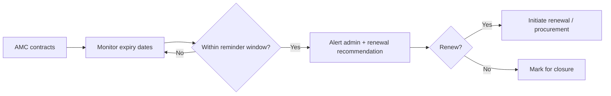

**Core Data:** ConsumableItem, StockTransaction, ReorderRule, Asset, AMCContract, FacilityRequest, MaintenanceSchedule, Vendor.

**Integrations:** Email/notification hub, procurement (auto-raise reorder), vendor master, calendar.

**KPIs:** Stock-out incidents, on-time AMC renewals (target 100%), forecast accuracy (MAPE), maintenance SLA adherence.

---

### Module 3 — Smart Workspace Management

**Objective:** Visual, self-service desk/room booking with real-time, service-line-wise utilisation insight.

**Key Features**
- **Visual desk booking** — *movie-seat / bus-reservation style* interactive **floor map** (available / booked / blocked / mine), filter by floor, zone, service line, amenities.
- **Flexible/hybrid booking**: single-day, recurring, half-day, team/neighborhood booking; check-in to confirm; auto-release no-shows.
- **Meeting-room booking** with capacity/AV filters.
- **WhatsApp booking flow**: book / cancel / view via chat, with **confirmation notification** (and Teams/Slack parity).
- **Occupancy tracking** (booking-based; optional sensor/badge feed later).
- **Dashboards**: occupancy **heatmaps**, **service-line-wise utilisation %**, peak analysis, no-show rates, space planning reports.
- **Workspace Optimization Agent**: detect under/over-utilised zones, suggest reallocation & right-sizing.

**Desk Booking UX (conceptual)**
```
 Floor 3 — Pune  | Service Line: Cloud  [▣ available  �auto ▤ booked  ✕ blocked  ★ mine]
   A: ▣ ▣ ▤ ▣ ★ ▣        Legend & filters: [Floor ▾][Zone ▾][Date ▾][Amenities ▾]
   B: ▤ ▣ ▣ ✕ ▣ ▣        Tap a seat → details → Confirm → WhatsApp/Email confirmation
   C: ▣ ★ ▣ ▣ ▤ ▣
```

**AI Agents:** Workspace Optimization, Utilisation Forecasting.

**Booking Workflow**
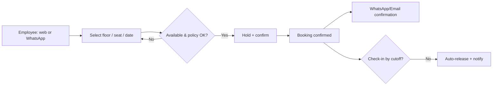

**Core Data:** Office, Floor, Zone, Desk, MeetingRoom, Booking, CheckIn, OccupancyRecord, ServiceLine.

**Integrations:** WhatsApp Cloud API, Teams/Slack, HRMS (employee→service line), calendar, optional IoT/badge.

**KPIs:** Desk utilisation %, service-line utilisation, no-show %, booking adoption, space cost/seat optimisation.

---

### Module 4 — AI Travel Desk Agent

**Objective:** Replace manual, multi-hour quote comparison with near-real-time, policy-aware travel recommendations and assisted booking; proactively monitor fares & schedules.

**Key Features**
- Travel request intake (origin, destination, dates, purpose, preferences) with **policy checks** (cabin class, advance booking, budget).
- **Aggregate & normalise options**:
  - Flights/hotels/transport from **licensed travel APIs / GDS / aggregators**.
  - **Travel-agent quotations** ingested (email/upload) and **parsed/normalised** to compare apples-to-apples with portal options.
- **Best-option recommendation** balancing price, schedule, service/support, and policy compliance — with a transparent comparison sheet.
- **Assisted booking** (agent prepares; human/traveller confirms) and hand-off to chosen vendor/portal.
- **Fare-drop & schedule-change monitoring** with alerts and **rebooking recommendations**.
- **Visa-requirement suggestions** (links to Module 6) and **travel-risk notifications**.
- End-to-end trip record: flights + hotel + local transit + approvals + documents.

**AI Agents:** Flight Search, Hotel Search, Quote Comparison, Fare/Schedule Monitoring, Travel Planner, Travel Compliance.

**Travel Workflow**
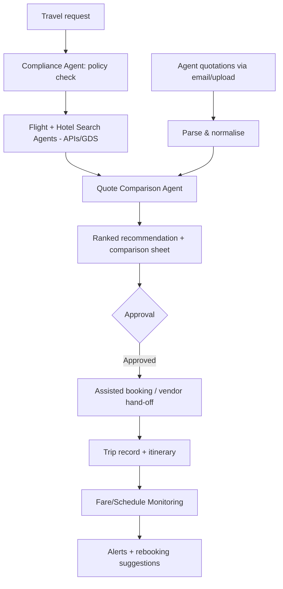

**Core Data:** TravelRequest, Traveler, Itinerary, FlightOption, HotelOption, TransitOption, VendorQuote, Comparison, Booking, FareWatch, TravelPolicy.

**Integrations:** Travel content APIs/GDS (e.g., aggregator/NDC providers), corporate travel/TMC if any, email ingestion for agent quotes, calendar, expense/ERP, WhatsApp/Teams for approvals & alerts, Visa module.

> **Compliance note:** Use **partner/aggregator APIs and TMC channels** for live content and booking; **do not scrape** consumer booking sites (ToS/anti-bot/legal risk and unreliability). Agent quotations are ingested with consent. Booking remains **assisted/approved**, not fully autonomous, until policy & vendor agreements permit.

**KPIs:** Quote turnaround time, cost savings vs. baseline, policy-compliance rate, fare-alert savings, traveller satisfaction.

---

### Module 5 — Invoice & Payment Intelligence

**Objective:** Automate invoice tracking and UTR-based payment reconciliation shared by Finance.

**Key Features**
- **Invoice ingestion** (email, upload, Finance feed) + **OCR/Document-AI extraction** (invoice no., vendor, amount, date, PO ref).
- **Matching**: invoice ↔ PO ↔ GRN (where applicable) ↔ payment record.
- **UTR reconciliation**: when **UTR is updated** post-approval, **auto-flip status "Not Paid" → "Paid"**; flag mismatches/exceptions.
- **Dashboards**: Paid/Unpaid, ageing, vendor-wise payments, exceptions queue, finance reconciliation reports.
- Duplicate-invoice & anomaly detection.

**AI Agents:** Invoice Matching, Payment Reconciliation.

**Reconciliation Workflow**
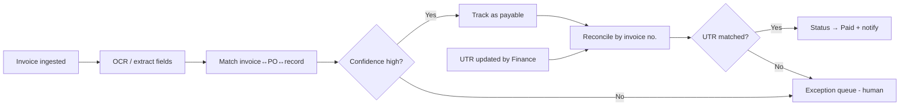

**Core Data:** Invoice, Vendor, PurchaseOrder, PaymentRecord, UTRReference, ReconciliationResult, Exception.

**Integrations:** Finance/ERP (read invoice & UTR records), bank statement/UTR feed (via Finance), document store, notification hub.

> **Boundary:** OASIS reconciles and reports; **Finance/ERP remains the system of record for payments**. OASIS does not initiate payments.

**KPIs:** Auto-match rate (≥99% target), reconciliation time, exception volume, days-to-status-update, duplicate detections.

---

### Module 6 — Visa Assistant Agent

**Objective:** Reduce manual effort in visa appointment tracking and documentation guidance (US B1/H1B/L1, plus Schengen/UK as listed).

**Key Features**
- **Visa documentation guidance** & checklists per visa type (RAG over official rules + Opus SOPs).
- **Application guidance** & status tracking.
- **Appointment-slot availability monitoring** with **notifications** when a slot becomes available.
- Calendar of appointments, reminders, document-expiry alerts.

**AI Agent:** Visa Assistant Agent (doc guidance + monitoring + notify).

> ### ⚠️ Compliance & Ethical Design (mandatory)
> Automating official visa scheduling portals is **legally and contractually sensitive**. The design **must**:
> - Be **notification-only**: detect/inform availability; **do not auto-book**, and **do not bypass CAPTCHAs, rate limits, or anti-bot controls**.
> - Keep a **human-in-the-loop**: the user/officer books manually once notified.
> - **Respect Terms of Service** and applicable law; prefer **official APIs/channels** where they exist; obtain **explicit, documented consent** for any credential use and store credentials in a secrets vault with least privilege.
> - Undergo **Legal/Compliance sign-off before build**. If a portal's ToS prohibits automated access, this capability is limited to manual-assist + guidance only.
> - This plan deliberately **excludes** any slot-grabbing/evasion techniques. The value delivered is **guidance, tracking, reminders, and compliant availability awareness**.

**Workflow (compliant)**
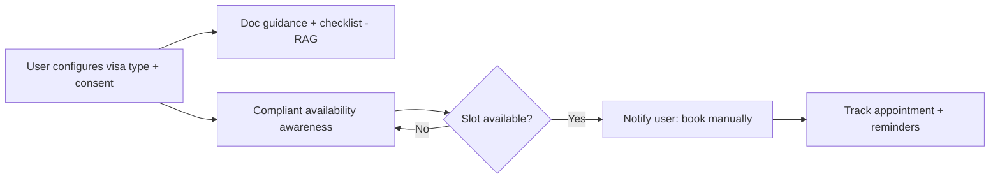

**Core Data:** VisaCase, VisaType, DocumentChecklist, Appointment, Reminder, ConsentRecord.

**Integrations:** Notification hub, calendar, KB; visa portals only via **compliant, approved** means.

**KPIs:** Time saved in tracking, on-time documentation, appointments secured, zero compliance incidents.

---

### Module 7 — Enterprise Administration Chatbot

**Objective:** One conversational front door across all admin services, on every channel.

**Key Features**
- Natural-language interface for: procurement, travel, workspace, invoices, assets, facilities, **policies/FAQs**, helpdesk.
- **RAG-based enterprise search** with citations.
- **Multi-agent orchestration**: chatbot delegates to domain agents to *act* (e.g., "book a desk tomorrow on floor 3", "status of invoice 1023", "raise a laptop procurement request").
- **Personalised** to the user (role, office, service line, history).
- **Channels:** Web (in Opus Sync), Mobile/PWA, **MS Teams, WhatsApp, Slack**, email.
- Seamless **human handoff** to the admin team with full context when needed.

**Conversation flow**
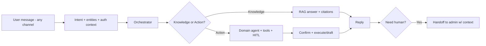

**Integrations:** All modules' tools, channel adapters (Teams, WhatsApp, Slack), SSO for identity, KB.

**KPIs:** Deflection rate (≥50%), task completion rate, CSAT, containment, average handling time reduction.

---

### Enhancement Modules (recommended additions)

| Module | Why it matters |
|---|---|
| **Events Management** | Explicitly in admin's remit; plan/track events, budgets, vendors, RSVPs, logistics. |
| **Admin Helpdesk / Ticketing** | Unified intake & SLA tracking for any admin request not covered by a specific module. |
| **Vendor & Contract Lifecycle (CLM)** | Single vendor master, onboarding, KYC, contract repository feeding Procurement/AMC/Travel. |
| **Asset Lifecycle Management** | Full IT/non-IT asset register, assignment, audits, depreciation. |
| **Visitor & Reception Management** | Pre-registration, badges, host notifications. |
| **Spend Analytics & Budgeting** | Cross-module spend visibility, budgets, forecasts for leadership. |
| **Sustainability/ESG reporting** | Space, travel, and consumable footprint reporting (increasingly required). |

---

## 10. Data Architecture & Data Model

### 10.1 Strategy
- **Polyglot persistence**: PostgreSQL (OLTP, system of record per module), Redis (cache/sessions/locks), Object storage (documents/invoices/quotes), Vector store (embeddings), Analytics lakehouse/warehouse (reporting & dashboards).
- **Single logical data model** with clear bounded contexts; shared **master data** (Employee, Vendor, Office, ServiceLine, CostCenter) via a master-data service.
- **Event sourcing for audit-critical flows** (invoices, approvals, bookings) → immutable audit log.
- **CDC → lakehouse** for analytics without loading OLTP.

### 10.2 Core Master Data
`Employee` (from HRMS) · `ServiceLine` · `Office/Region` · `CostCenter` · `Vendor` · `Policy`.

### 10.3 Key Entities by Module (high level)

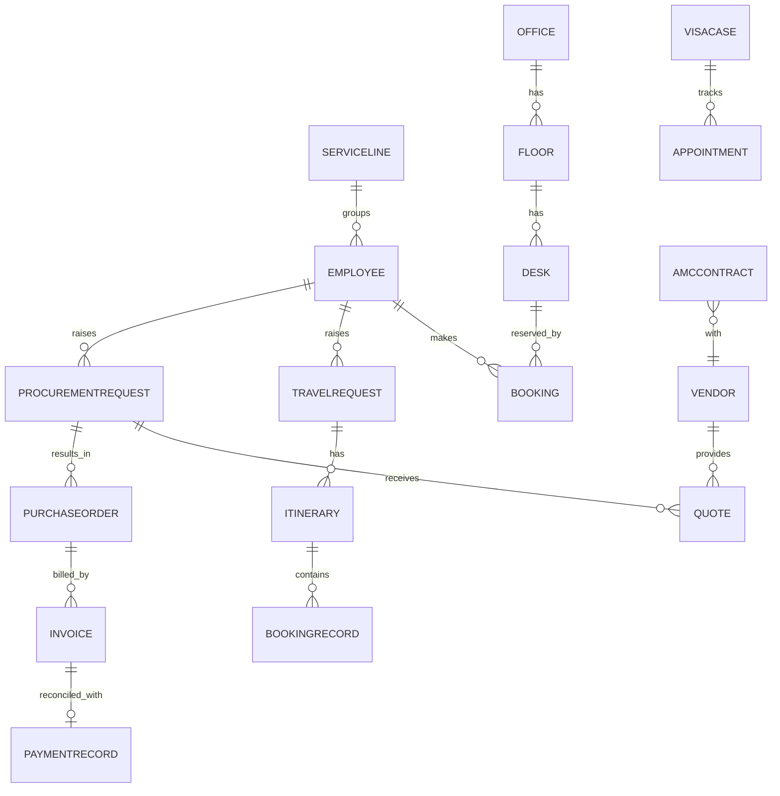

### 10.4 Data Governance
Data classification (Public/Internal/Confidential/Restricted-PII), retention policies, encryption (at rest/in transit), masking for PII (passport, visa, bank/UTR), and lineage. Restricted data (visa/finance) carries stricter ACLs and is excluded from general RAG collections unless authorised.

---

## 11. Integration Architecture

| System | Purpose | Pattern |
|---|---|---|
| **Opus Sync** | Entry point, SSO, deep links, embedded widgets | OIDC SSO + iframe/widget + REST |
| **Identity (Entra ID / Azure AD)** | Authentication, groups, MFA | OAuth2/OIDC, SCIM |
| **HRMS** | Employee master, service line, manager | API / nightly sync + CDC |
| **Finance / ERP** | Invoices, POs, UTR, payment status | API / secure file feed / events |
| **Travel APIs / GDS / Aggregators** | Flight/hotel/transit content & booking | REST, NDC, partner SDKs |
| **WhatsApp Business Cloud API** | Desk booking, alerts, chatbot | Webhooks + send API (Meta/BSP or Twilio) |
| **MS Teams / Slack** | Chatbot, approvals, notifications | Bot framework / apps |
| **Email (Graph/SMTP)** | Ingestion (quotes/invoices) + outbound | Graph API / IMAP / SMTP |
| **Bank/UTR feed** | Payment confirmation | Via Finance (no direct bank access) |
| **Document AI / OCR** | Invoice & quote extraction | Managed OCR service |

**Principles:** integrate via **APIs and events**, an **anti-corruption layer** per external system, secrets in a **vault**, idempotent webhooks, retry/dead-letter queues, and a published integration contract catalog.

---

## 12. API Strategy

- **External/edge**: REST (OpenAPI-documented) via API Gateway; **GraphQL** optionally for the portal's aggregated reads.
- **Internal service-to-service**: REST/gRPC + async events.
- **AI tools**: exposed to agents via **MCP / function-calling** with strict JSON schemas and authorization scoping.
- **Standards**: versioning (`/v1`), pagination, idempotency keys, problem+json errors, rate limiting, OAuth2 scopes, webhook signing.
- **Developer portal** with API catalog and sandbox for future module teams.

---

## 13. Security, Privacy, Compliance & Governance

| Domain | Controls |
|---|---|
| **AuthN** | SSO via Entra ID/OIDC, MFA, conditional access |
| **AuthZ** | RBAC + ABAC at API and data layers; least privilege; segregation of duties (esp. Finance/Procurement) |
| **Data protection** | Encryption in transit (TLS1.2+) & at rest; PII tokenisation/masking (passport, visa, UTR, bank); field-level encryption for restricted data |
| **Secrets** | Central vault (Key Vault/Secrets Manager); no secrets in code; rotation |
| **AI safety** | Prompt-injection defenses, output filtering, PII redaction pre-model, enterprise/zero-retention model terms, RAG ACL enforcement, HITL gates |
| **Audit** | Immutable, queryable audit trail for all sensitive actions & agent decisions |
| **App security** | OWASP ASVS, SAST/DAST/dependency & container scanning in CI, pen-test before go-live |
| **Compliance** | GDPR + India DPDP Act (and per-region laws); DPIA for PII modules; travel/visa ToS & legal review; data-residency per region |
| **Resilience** | Backups, PITR, DR with RTO/RPO targets, BCP runbooks |
| **Governance** | Data classification, retention schedules, access reviews, change management, AI usage policy & model registry |

**Data residency:** multi-region storage honoring local rules (e.g., EU data in EU); restricted PII partitioned and access-logged.

---

## 14. Cloud & Infrastructure Architecture

**Recommended primary cloud: Microsoft Azure** (best fit given Opus Sync + likely M365/Teams ecosystem and Entra ID SSO). The design is **cloud-agnostic**; AWS/GCP equivalents are noted. Final choice is an open decision (§23).

| Capability | Azure (primary) | AWS equivalent | GCP equivalent |
|---|---|---|---|
| Compute / containers | AKS + Container Apps | EKS / ECS Fargate | GKE / Cloud Run |
| API gateway | Azure API Management | API Gateway | Apigee |
| Managed Postgres | Azure DB for PostgreSQL | RDS/Aurora PG | Cloud SQL/AlloyDB |
| Cache | Azure Cache for Redis | ElastiCache | Memorystore |
| Object storage | Blob Storage | S3 | GCS |
| Vector / search | Azure AI Search (hybrid) | OpenSearch / Kendra | Vertex Vector Search |
| LLM hosting | Azure OpenAI / Anthropic | Bedrock | Vertex AI |
| Document AI / OCR | Azure AI Document Intelligence | Textract | Document AI |
| Eventing | Service Bus / Event Hubs | SNS/SQS/MSK | Pub/Sub |
| Identity | Entra ID | Cognito/IAM | Cloud Identity |
| Secrets | Key Vault | Secrets Manager | Secret Manager |
| Observability | Azure Monitor/App Insights | CloudWatch/X-Ray | Cloud Ops |
| IaC | Bicep/Terraform | Terraform | Terraform |

**Topology:** multi-environment (Dev/Test/Staging/Prod), multi-region for resilience & residency, private networking (VNet + private endpoints), WAF/CDN at edge, autoscaling, blue-green/canary deploys.

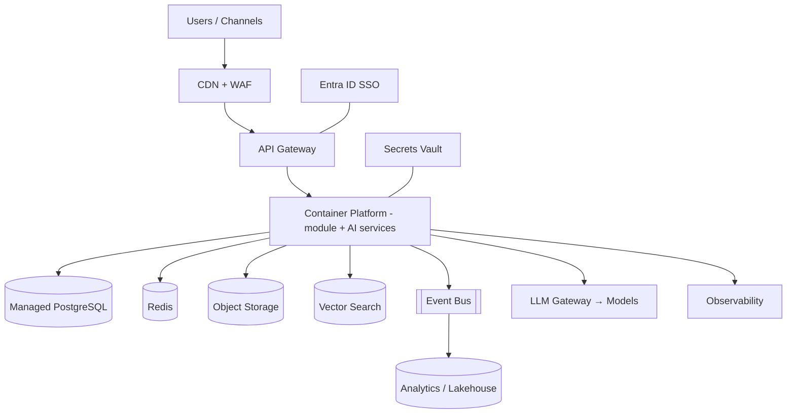

---

## 15. DevOps, CI/CD & Observability

- **IaC** (Terraform/Bicep) for all environments; GitOps for deployments.
- **CI/CD**: build → unit/integration tests → SAST/DAST/dependency/container scans → **AI eval gates** (retrieval & answer quality) → staged deploy with canary.
- **Containerised** services; AKS/Container Apps; horizontal autoscaling.
- **Observability**: centralized logs, metrics, distributed tracing; **LLM observability** (token cost, latency, quality, hallucination/guardrail hits) via tracing tooling; dashboards & alerting; on-call runbooks.
- **Feature flags** for progressive delivery; **environment parity**; automated DB migrations.

---

## 16. Non-Functional Requirements

| NFR | Target |
|---|---|
| Availability | 99.9% core portal; 99.5% AI features |
| Latency | Web API p95 < 500ms; chatbot first-token < 2s; agent task acknowledgements < 3s |
| Scalability | 1000+ employees; thousands of bookings/day; horizontal scale |
| Throughput | Burst handling for month-end invoices, peak booking hours |
| Security | Controls per §13; pen-test pass before go-live |
| Privacy | DPDP/GDPR compliant; DPIA complete for PII modules |
| Reliability | RTO ≤ 4h, RPO ≤ 15min for system-of-record data |
| Accessibility | WCAG 2.1 AA for web/PWA |
| Localisation | Multi-timezone, multi-currency, English (extensible) |
| Maintainability | Modular, documented APIs, ≥80% critical-path test coverage |
| AI quality | Tracked accuracy/faithfulness thresholds with regression gates |

---

## 17. Technology Stack Summary

| Layer | Recommendation | Rationale |
|---|---|---|
| **Frontend** | React + TypeScript (Next.js), component lib (e.g., MUI/Ant), interactive floor-map (Canvas/SVG/Konva) | Mature, fast, great for dashboards + seat-map UX; PWA for mobile |
| **Mobile** | PWA first; React Native if native needed | Cost-effective reach |
| **Backend (AI services)** | **Python + FastAPI** | Best AI/agent ecosystem |
| **Backend (core business)** | **Java 21 + Spring Boot 3** (Spring Web/WebFlux, Spring Security, Spring Data JPA, Spring Batch, Spring Kafka; Maven/Gradle) | Enterprise-grade & battle-tested for finance/procurement/invoicing transactional workloads; richest security & batch ecosystem; deepest talent pool |
| **Agent framework** | **LangGraph** (orchestration) + LlamaIndex/LangChain (RAG) + **MCP** tools | Stateful multi-agent, tool-calling, mature RAG |
| **LLM** | Model router over Azure OpenAI / Anthropic Claude / OSS; embeddings model | Best-fit-per-task, cost control, no-train terms |
| **Vector/Search** | Azure AI Search (hybrid) or pgvector/Weaviate/Pinecone | Hybrid retrieval + ACLs |
| **OCR/Doc AI** | Azure AI Document Intelligence / Textract | High-accuracy invoice extraction |
| **Database** | PostgreSQL + Redis | Reliable OLTP + caching |
| **Object store** | Blob/S3 | Documents, invoices, quotes |
| **Workflow/BPM** | **Camunda 8** (Java/Spring-native) or Temporal (Java SDK) | Durable approvals & long-running flows; Camunda pairs naturally with the Spring Boot stack |
| **Eventing** | Kafka / Azure Service Bus + Event Hubs | Async, decoupled, analytics |
| **Analytics/BI** | Lakehouse (Databricks/Synapse/BigQuery) + Power BI/Metabase | Dashboards, heatmaps, reports |
| **Notifications** | Notification hub over Email (Graph), **WhatsApp Cloud API**, Teams, Slack, push | Omnichannel |
| **Identity** | Entra ID (Azure AD), OIDC/OAuth2, MFA | Enterprise SSO, integrates with Opus Sync |
| **Infra/DevOps** | Containers + AKS, Terraform/Bicep, GitHub Actions/Azure DevOps | Cloud-native, automatable |
| **Observability** | OpenTelemetry + Azure Monitor + LLM tracing (e.g., Langfuse/Arize) | Full-stack + AI observability |
| **Secrets** | Key Vault / Secrets Manager | Secure credential handling |

---

## 18. Implementation Roadmap & Phasing

> Indicative timeline assuming a ~10–14 person team (see §19). Phases ship independently usable value. Durations are planning estimates to validate in discovery.

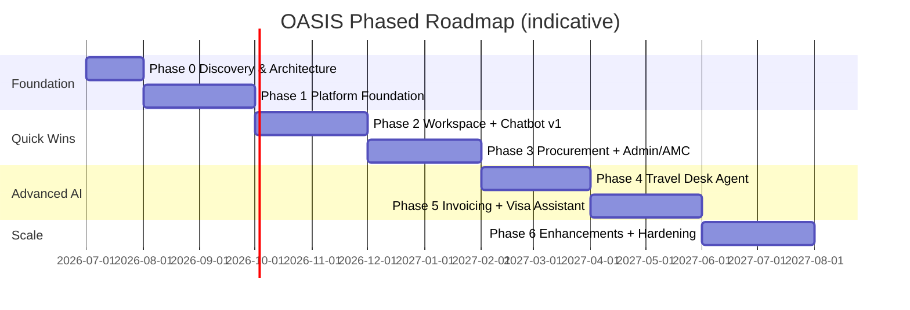

| Phase | Focus | Key Deliverables | Exit Criteria |
|---|---|---|---|
| **0 — Discovery & Architecture** (~6 wks) | Requirements deep-dive, integration discovery, decisions (cloud, models, ToS/legal for visa & travel), DPIA scoping | Finalized architecture, backlog, environments scaffolded | Sign-off on architecture & compliance approach |
| **1 — Platform Foundation** (~10 wks) | SSO/Opus Sync, RBAC/ABAC, data model & master data, event bus, **RAG + KB**, notification hub, dashboard framework, CI/CD, observability, **chatbot shell** | Reusable platform + foundational chatbot | Auth, RAG Q&A, notifications, one dashboard live |
| **2 — Workspace + Chatbot v1** (~8 wks) | Desk/room booking + floor map, WhatsApp booking, utilisation dashboards; chatbot does bookings | Highest-visibility employee win | Employees book via web/WhatsApp; utilisation reports live |
| **3 — Procurement + Admin/AMC** (~10 wks) | Procurement request→compare→recommend→approve; inventory forecasting; AMC alerts | Admin-team core automation | Comparison reports auto-generated; AMC/stock alerts firing |
| **4 — Travel Desk Agent** (~10 wks) | API/GDS aggregation, quote normalisation & comparison, assisted booking, fare/schedule monitoring | Travel automation | Near-real-time options + alerts; turnaround hours→minutes |
| **5 — Invoicing + Visa** (~8 wks) | OCR ingestion, invoice↔UTR reconciliation, dashboards; visa guidance + **compliant** monitoring | Finance & visa relief | ≥99% auto-match; visa notifications (compliant) |
| **6 — Enhancements & Hardening** (~8 wks) | Events, Helpdesk, CLM, asset lifecycle, spend analytics; perf/security hardening, pen-test, DR drill | Production-grade breadth | NFRs met; pen-test passed; rollout complete |

**Cross-phase:** continuous AI evaluation, change management & user training, and incremental Opus Sync integration.

---

## 19. Team Structure & RACI

### Core Team (scale up/down by phase)

| Role | Count | Focus |
|---|---|---|
| Solution/Enterprise Architect | 1 | Architecture, governance, decisions |
| AI/ML Engineer (Agents, RAG) | 2 | Agents, RAG, evals, model routing |
| Backend Engineer | 2–3 | Module services, integrations, workflow |
| Frontend Engineer | 2 | Portal, floor-map UX, dashboards |
| Data Engineer | 1 | Pipelines, lakehouse, analytics |
| DevOps/Cloud Engineer | 1 | IaC, CI/CD, observability, security infra |
| QA / Test (incl. AI eval) | 1–2 | Functional + AI quality |
| UX Designer | 1 (part) | Booking UX, dashboards, chatbot |
| Product Owner / BA | 1 | Backlog, stakeholder liaison |
| Security/Compliance | 1 (part/shared) | DPIA, controls, ToS/legal coordination |
| Project/Delivery Manager | 1 | Delivery, risk, governance |

### RACI (sample, by workstream)

| Activity | Architect | AI Eng | Backend | DevOps | PO/BA | Security | Admin/Finance SME |
|---|---|---|---|---|---|---|---|
| Architecture & decisions | A/R | C | C | C | C | C | I |
| Agent & RAG design | C | A/R | C | I | C | C | C |
| Module build | C | C | A/R | C | C | I | C |
| Integrations | C | C | R | A | C | C | C |
| Security & compliance | C | C | C | C | I | A/R | C |
| Visa/Travel ToS & legal | A | C | I | I | R | A/R | C |
| UAT & sign-off | I | C | C | I | A/R | C | R |

*(A=Accountable, R=Responsible, C=Consulted, I=Informed.)*

---

## 20. Cost Estimation

> **Rough order-of-magnitude (ROM)** — for budgeting only; refine in Phase 0. Figures are indicative ranges in USD and vary by region, rates, and final scope/cloud.

### One-time Build (≈9–12 months)

| Item | Indicative Range |
|---|---|
| Engineering team (blended, ~12 FTE × duration) | Primary cost driver — scope with finance using local blended rates |
| Discovery, UX, PM, QA | Included in team |
| Third-party setup (travel API onboarding, WhatsApp BSP, OCR) | Low–moderate |
| Security testing / pen-test / DPIA | Moderate one-time |

### Recurring Run (annual)

| Item | Indicative Range (annual) | Notes |
|---|---|---|
| Cloud infra (compute, DB, storage, search, networking) | $$ | Scales with usage; optimise with autoscaling/reserved capacity |
| **LLM/API usage** | $$–$$$ | Largest variable; controlled via model routing, caching, batching, token budgets |
| Vector/search service | $ | |
| OCR/Document AI | $ | Per-page pricing |
| WhatsApp Business (conversation-based) | $ | Per-conversation pricing |
| Travel API/GDS access | $$ | Often partner/transaction-based |
| Observability/security tooling | $ | |
| Support & maintenance (team) | $$ | Post-go-live run team |

**Cost-optimisation levers:** task-appropriate model routing (small models for routine), prompt/semantic caching, retrieval over long-context stuffing, batch jobs for monitoring, reserved/spot cloud capacity, and usage metering with budget alerts.

---

## 21. ROI Analysis

**Quantitative drivers**
- **Labor reallocation:** ≥60% reduction in manual effort across procurement comparison, travel quote handling, AMC/stock tracking, invoice reconciliation → frees the 4–5 admin team for higher-value work (and absorbs growth without headcount add).
- **Procurement savings:** data-driven vendor selection + rate-contract bias → typically low-to-mid single-digit % of addressable spend.
- **Travel savings:** automated comparison + fare-drop alerts → measurable per-trip savings + hours saved per request.
- **Space optimisation:** utilisation insight → right-size desks/floors → real-estate cost avoidance.
- **Error/penalty avoidance:** fewer missed AMC renewals, reconciliation errors, and stock-outs.

**Qualitative**
- Faster turnaround & employee satisfaction (self-service), better compliance & auditability, leadership visibility, and a scalable platform for future admin needs.

**Payback:** With travel + procurement + labor savings as primary drivers, a phased build typically targets payback within roughly **12–24 months** post key-module go-live; validate against Opus's actual spend baselines in Phase 0. Recommend tracking a benefits-realisation dashboard from Phase 2.

---

## 22. Risks & Mitigations

| # | Risk | Impact | Likelihood | Mitigation |
|---|---|---|---|---|
| R1 | **Visa portal automation violates ToS/law** | High | High | Notification-only + HITL + legal sign-off; no anti-bot evasion; official channels only (§Module 6) |
| R2 | **Travel-site scraping unreliable/illegal** | High | Med | Use licensed travel APIs/GDS/aggregators + agent-quote ingestion; no scraping |
| R3 | **LLM hallucination / wrong recommendations** | Med-High | Med | RAG grounding + citations, confidence gates, HITL, eval harness, guardrails |
| R4 | **PII/data exposure (visa, finance, passport)** | High | Low-Med | Encryption, masking, ACL-aware RAG, least privilege, DPIA, no-train model terms |
| R5 | **LLM cost overruns** | Med | Med | Model routing, caching, token budgets, usage alerts |
| R6 | **Integration dependencies (ERP/HRMS/Finance feeds)** | Med | Med | Early discovery, anti-corruption layers, contracts, fallbacks, phased integration |
| R7 | **Prompt injection via emails/web content to agents** | Med | Med | Input sanitisation, tool-scoping, allowlists, output validation |
| R8 | **Low user adoption** | Med | Med | Quick-win-first roadmap (Workspace/Chatbot), UX focus, training, Opus Sync embedding |
| R9 | **Scope creep across many modules** | Med | High | Phased delivery, strict backlog, MVP per module |
| R10 | **Data quality (vendor/inventory history)** | Med | Med | Master-data cleanup, validation, human review early |
| R11 | **Multi-region compliance/residency** | Med | Med | Region-aware storage, data classification, per-region policies |
| R12 | **Over-automation removing human judgement** | Med | Low | HITL by design on financial/contractual/external actions |

---

## 23. Assumptions & Open Decisions

**Assumptions**
- Opus Sync supports SSO (OIDC/SAML) and linking/embedding OASIS.
- Microsoft 365 / Teams + Entra ID is the identity & collaboration backbone.
- Finance/ERP and HRMS expose APIs or secure feeds (invoices, UTR, employee/service-line).
- Travel content will be sourced via **licensed APIs/aggregators/TMC**, plus ingested agent quotes.
- Visa capability is **notification + guidance only**, pending legal/ToS review.
- English-first UI; multi-currency/timezone required.

**Open decisions for review (need stakeholder input)**

| # | Decision | Options | Recommendation |
|---|---|---|---|
| D1 | Primary cloud | Azure / AWS / GCP | **Azure** (M365/Entra/Opus Sync fit) |
| D2 | Primary LLM provider(s) | Azure OpenAI / Anthropic Claude / OSS / multi | **Multi-model router**, enterprise/no-train terms |
| D3 | Core backend language | ~~Python-only / .NET / Node~~ | ✅ **DECIDED: Java 21 + Spring Boot 3** for core business services; **Python + FastAPI** retained for AI/agent services |
| D4 | Travel content provider(s) | GDS (Amadeus/Sabre/Travelport) / aggregator (Duffel/Kiwi/etc.) / TMC | Choose by region coverage + commercials |
| D5 | WhatsApp delivery | Meta Cloud API direct / BSP (Twilio etc.) | BSP for faster onboarding |
| D6 | Build vs. buy per module | e.g., desk-booking SaaS vs. build | Build (unified data + AI); reassess in Phase 0 |
| D7 | Visa scope | Guidance+notify only / fuller automation | **Guidance+notify only** until legal clears |
| D8 | Budget envelope & target go-live | — | Set in Phase 0 to size team |

---

## 24. Future Enhancements

- **Voice assistant** (Teams/phone) for hands-free admin tasks.
- **Predictive analytics**: spend forecasting, demand prediction, dynamic space planning.
- **Autonomous (policy-bounded) booking** once trust & vendor agreements mature.
- **IoT/sensor & badge integration** for true real-time occupancy.
- **Negotiation agent** for vendor price negotiation assistance.
- **Multilingual** chatbot for global offices.
- **Carbon/ESG dashboards** for travel & facilities.
- **Mobile native apps** with push and offline.
- **Marketplace of admin micro-apps** on the OASIS platform for new admin needs.
- **Agentic workflows expansion**: end-to-end "intents" spanning multiple modules (e.g., "set up new joiner" → desk + assets + access + welcome kit).

---

## 25. Appendix

### 25.1 Glossary
- **RAG** — Retrieval-Augmented Generation.
- **MCP** — Model Context Protocol (typed tool interface for agents).
- **HITL** — Human-in-the-loop.
- **GDS** — Global Distribution System (travel).
- **NDC** — New Distribution Capability (airline content standard).
- **AMC** — Annual Maintenance Contract.
- **UTR** — Unique Transaction Reference (payment).
- **ABAC/RBAC** — Attribute/Role-Based Access Control.
- **DPIA** — Data Protection Impact Assessment.
- **CLM** — Contract Lifecycle Management.

### 25.2 Agent ↔ Tool Matrix (illustrative)

| Agent | Reads | Writes (via HITL where noted) |
|---|---|---|
| Procurement Research | catalog, vendor DB, market APIs | comparison report (draft) |
| Vendor Recommendation | history, scores | recommendation (draft) |
| Inventory Prediction | stock, consumption | reorder alert |
| AMC Renewal | contracts, calendar | renewal reminder |
| Flight/Hotel Search | travel APIs | option set |
| Quote Comparison | quotes, options | ranked comparison |
| Fare Monitoring | price feeds | fare alert |
| Invoice Matching | invoices, POs (OCR) | match result; status (gated) |
| Payment Reconciliation | UTR, payment records | status flip (gated) |
| Visa Assistant | KB, monitor (ToS) | notification (no booking) |
| Knowledge/RAG | KB/vector | cited answer |

### 25.3 Consolidated KPI Dashboard (platform-level)
Effort reduction % · Procurement cycle time & savings · Travel turnaround & savings · Desk/service-line utilisation % · Invoice auto-match % & ageing · AMC on-time renewals · Chatbot deflection & CSAT · AI cost per task · Compliance incidents (target 0).

---

*End of Implementation Plan v1.0 (Draft for Review). Ready for stakeholder walkthrough; Phase 0 will finalize open decisions (§23), validate cost/ROI baselines, and complete legal/compliance sign-off for the Visa and Travel modules.*
