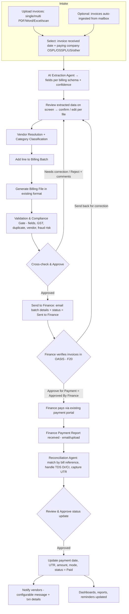
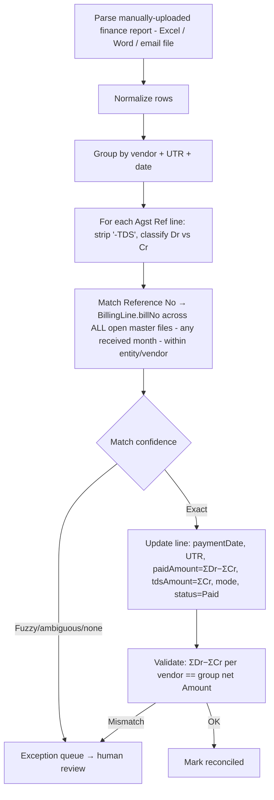
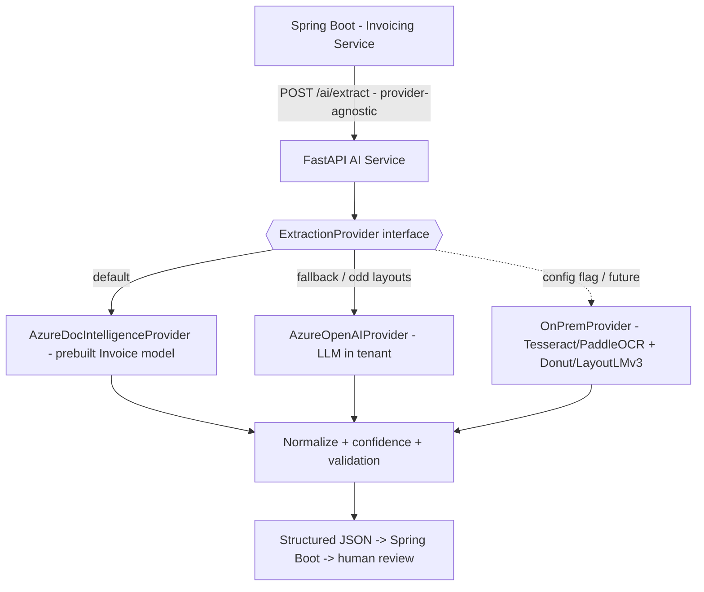
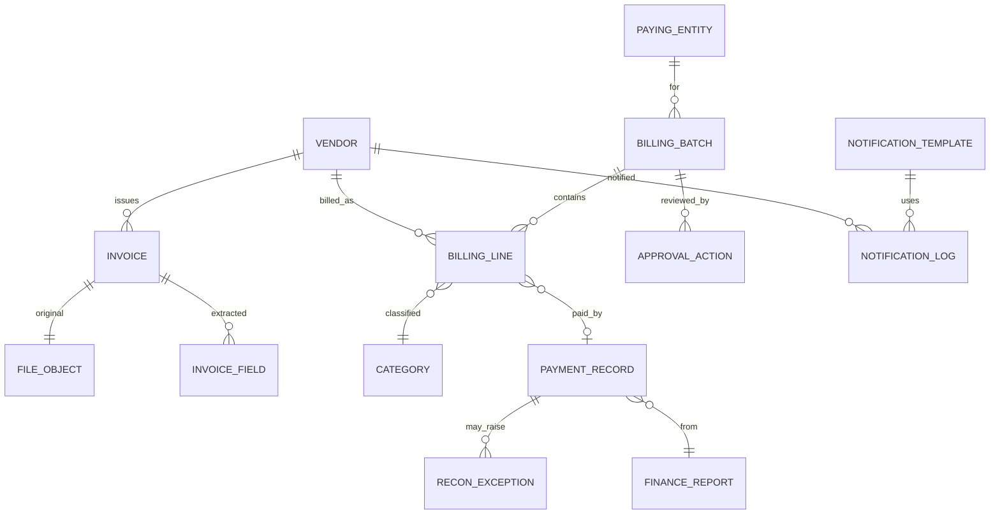
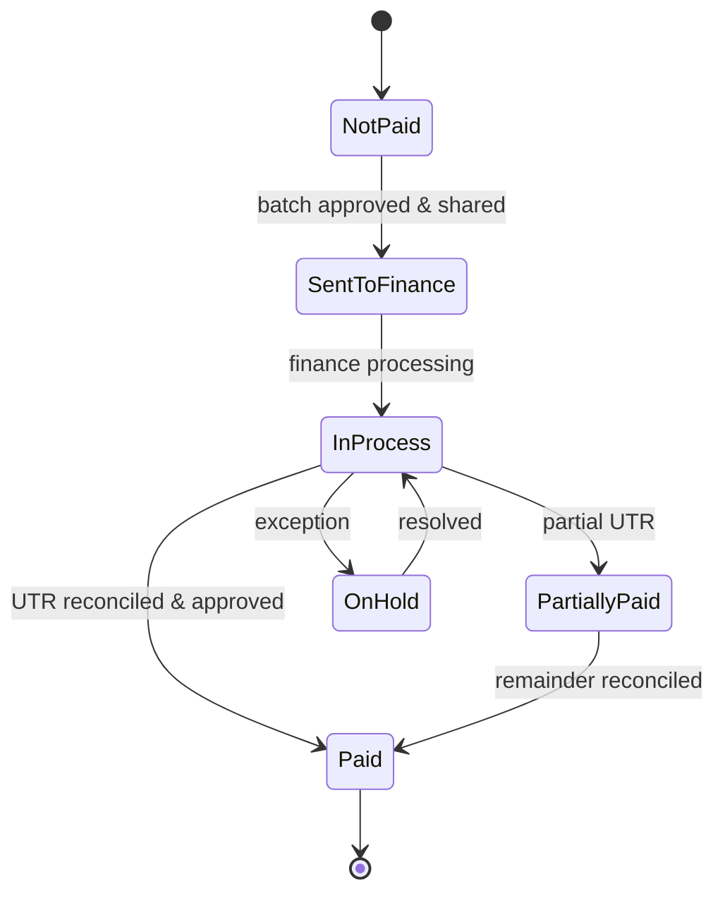
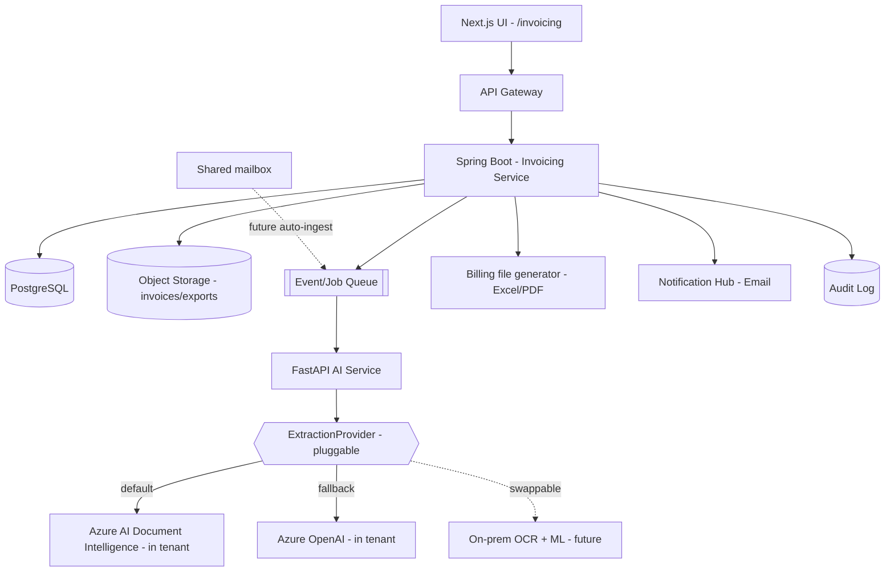

# OASIS — Module 5: Invoice & Payment Intelligence
### Detailed Enterprise Design & Implementation Plan

**Part of:** OASIS — Opus Administration & Service Intelligence Suite (see [implementation_plan.md](implementation_plan.md) §9 Module 5)
**Version:** 1.4 (Draft for Review — adds the **monthly Master File** model: daily bill files coded `BILL-DD-MON-YYYY-<I/II>` roll up by received month; **master-level reconciliation** of one **monthly** finance report matched across all open masters, handling **cross-month** payments. Prior 1.3: Finance verification/approval workflow (F20), Reports module + scheduled delivery (F19), invoice-level entity, batch & per-invoice edit/delete + bulk approval, original-invoice view/download (F5), payment-cycle capture) · **Date:** 2026-06-04 · **Status:** Pending stakeholder review
**Stack (inherited):** Next.js + TypeScript (frontend) · Java 21 + Spring Boot 3 (core services) · Python + FastAPI (AI services) · PostgreSQL + Redis · Object storage · **Pluggable extraction engine — Azure AI Document Intelligence (default, tenant-bound/in-region/no-train) with a swappable on-prem option** (see §10.9)

> This document is grounded in the real artifacts supplied in `Data/`: the billing MIS workbook, the finance payment-details email, the payment screenshot, and sample invoices.

---

## Table of Contents
1. [Objective & Scope](#1-objective--scope)
2. [Current State (As-Is)](#2-current-state-as-is)
3. [Pain Points → Solution Map](#3-pain-points--solution-map)
4. [Target End-to-End Workflow (To-Be)](#4-target-end-to-end-workflow-to-be)
5. [Personas & Roles](#5-personas--roles)
6. [Functional Requirements & Traceability](#6-functional-requirements--traceability)
7. [Billing Sheet — Field Specification](#7-billing-sheet--field-specification)
8. [Finance Payment Report — Reconciliation Spec](#8-finance-payment-report--reconciliation-spec)
9. [Expense Categories](#9-expense-categories)
10. [AI Agents Design](#10-ai-agents-design)
11. [Data Model](#11-data-model)
12. [State Machines](#12-state-machines)
13. [Screen-by-Screen UI Design](#13-screen-by-screen-ui-design)
14. [API Design](#14-api-design)
15. [Technical Architecture](#15-technical-architecture)
16. [Reports & Dashboards](#16-reports--dashboards)
17. [Notifications & Reminders](#17-notifications--reminders)
18. [Security, Compliance & Audit](#18-security-compliance--audit)
19. [Implementation Phases](#19-implementation-phases)
20. [Acceptance Criteria](#20-acceptance-criteria)
21. [Risks & Mitigations](#21-risks--mitigations)
22. [Assumptions & Open Questions](#22-assumptions--open-questions)
23. [Future Enhancements](#23-future-enhancements)

---

## 1. Objective & Scope

**Objective:** Eliminate the manual billing-sheet and payment-reconciliation effort by letting Admin upload invoices in any format, have AI extract the required fields, auto-generate the standard billing file, route it through approval to Finance, reconcile the returned payment report (UTR matching) automatically, notify vendors, and surface analytics — with a full audit trail.

**In scope:** Invoice intake & AI extraction, billing-batch generation in the existing format, multi-entity (OSPL/OSSPL/US) handling, approval workflow, Excel/PDF export, vendor master, finance-report ingestion & UTR reconciliation (incl. TDS), vendor payment notifications (configurable), search, reports/dashboards, due/overdue reminders. **Also (from design review): a pre-approval validation/compliance gate, cost-center/department spend tagging, fraud/anomaly risk scoring, a smart approval assistant, and upcoming-liability & SLA dashboards.**

**Out of scope (boundaries):**
- **OASIS does not make payments.** Finance's existing payment portal remains the system that disburses funds. OASIS produces the billing file, ingests the payment report, and reconciles/tracks status.
- General ledger / ERP accounting entries (OASIS integrates/exports; does not replace Finance ERP).

---

## 2. Current State (As-Is)

The admin owner (**"Sandeep"**) runs this entirely manually:

```mermaid
flowchart LR
  A[Invoices arrive: email softcopy or physical hard copy] --> B[Manually key data into Billing MIS Excel - fixed format]
  B --> C[Classify recurring / non-recurring, set credit period & due date]
  C --> D[Email billing sheet to Finance]
  D --> E[Finance verifies & pays via existing payment portal]
  E --> F[Finance emails Payment Details report - vendor, amount, ref no, UTR]
  F --> G[Manually match report to billing sheet by bill reference]
  G --> H[Manually update payment date, UTR, amount, mode, status]
  H --> I[Manually email each vendor the payment confirmation]
```



**Observed real formats (from `Data/`):**
- **Billing MIS workbook** — sheets: *Base Sheet* (line items), *Payment Cycle*, *Payment Status*, *Other Department bills*, plus pivot charts. Columns documented in §7.
- **Finance payment report** — delivered as an **Outlook email** ("Payment Details 30.05.2026 - OSPL") with a table grouped by vendor; each vendor shows a **net Amount + one UTR**, and per-bill **"Agst Ref"** rows with **Dr** (gross) and **Cr** (TDS) amounts. Documented in §8.
- **Sample invoices** — heterogeneous PDFs from many vendors (hotels, car rentals, telecom, copiers…), confirming **no fixed invoice format** → AI extraction required.

---

## 3. Pain Points → Solution Map

| # | Current Pain Point | OASIS Solution |
|---|---|---|
| 1 | Manual billing-file creation; bulk entry errors, slow | Bulk invoice upload + **AI extraction** → auto-populated billing batch with confidence flags & human confirm |
| 2 | Finance re-verifies & pays manually (payment portal already integrated) | Clean, validated, approved billing file (Excel/PDF + structured export/API) reduces Finance rework; OASIS does not change the payment portal |
| 3 | Manual status update after payment | **Auto-reconciliation** of finance report by bill reference → auto-update UTR, date, amount, mode, status (incl. TDS) |
| 4 | Manual vendor notification | **Configurable, auto-generated** vendor payment-confirmation emails (with transaction details), triggered post-reconciliation |
| 5 | No reports/dashboards (monthwise, recurring split, category spend, vendor) | **Analytics dashboards** + standard reports + ad-hoc search |
| 6 | No due / overdue / new-due reminders | **Reminder & alert engine** (due soon, overdue, newly due) to Admin/Finance; vendor-facing optional |

---

## 4. Target End-to-End Workflow (To-Be)



---

## 5. Personas & Roles

| Persona | Responsibilities | Key permissions |
|---|---|---|
| **Admin – Invoice Processor** (Sandeep) | Receives invoices daily; builds **multiple bill files per month** (`BILL-DD-MON-YYYY-<I/II>`) that roll up into the **monthly master file** (by received month) and shares them with Finance; review/confirm extraction; upload the **monthly** finance report; trigger notifications | Create/edit bill files & masters, run extraction & reconciliation |
| **Admin – Approver / Checker** | Cross-check billing batch & reconciliation; approve/reject/return with comments | Approve/reject, comment |
| **Admin Head / Manager** | Oversight, dashboards, escalations | Read-all, reports, config |
| **Finance** | Access the shared batch in OASIS; **verify each invoice** (incl. Payment Cycle); **Approve for Payment** → **Approved By Finance**; **send back for correction** or **edit/correct** invoices; pay via the existing portal; send the payment report | Per-invoice & batch finance approval, send-back, edit; (optional) upload report |
| **Vendor** (external) | Receives payment confirmation | None (notification recipient only) |
| **System Admin** | Categories, templates, entities, RBAC, integrations | Configuration |

**Segregation of duties:** maker–checker (Approve/Reject/Needs-correction) **provision** is built now; **role-based enforcement is deferred to the RBAC module** (later). For now the approval actions are available to any permitted user.

---

## 6. Functional Requirements & Traceability

Every requested capability mapped to a feature ID (used across this doc):

| ID | Requirement (from brief) | Section |
|---|---|---|
| **F1** | Upload screen; single/multiple files (PDF/Word/Excel/scan) with feasible size/count limits | §13.1, §14 |
| **F2** | AI reads varying-format invoices, extracts only billing-sheet-required fields | §10.1, §7 |
| **F3** | Show fetched data on screen; confirm per file before next; then generate billing file | §13.2 |
| **F4** | Select invoice received date + paying company; **provision to add/manage paying entities** + free-text for ad-hoc | §7, §13.1, §13.9 |
| **F5** | View/preview **and download** the originally uploaded invoice (in review, and per invoice within a batch) | §13.2, §13.3 |
| **F6** | Cross-check & approve: tabular view + Approve / Reject / Needs-correction + comments; **bulk multiselect** approve/reject; **edit/delete batch**; per-invoice **add / edit / reupload / delete** | §13.3, §12 |
| **F7** | Download billing file as Excel **and** PDF | §13.3, §14 |
| **F8** | Past records: monthwise, vendorwise | §13.4, §16 |
| **F9** | Search panel: date range, vendor, payment status, bill no, UTR, category | §13.4, §14 |
| **F10** | Upload finance payment report against original billing file | §13.5, §8 |
| **F11** | Update payment details by **unique bill reference number** | §8, §10.4 |
| **F12** | Review & approve after status update | §12, §13.5 |
| **F13** | Notify vendor with payment details; message configurable | §17, §13.6 |
| **F14** | Vendor onboarding/master (basic details reused for billing & notification) | §11, §13.7 |
| **F15** | Nice reports & dashboards | §16 |
| **F16** | Use AI agents wherever required | §10 |
| **F17** | Reminders/alerts for due, overdue, new-due payments | §17 |
| **F18** | Vendor notification in two modes — **(a) manual** trigger from UI and **(b) scheduled** (daily/weekly/monthly at a set time) scanning paid bills; an **"already notified" flag** prevents duplicate emails to the same vendor | §17, §11, §13.6 |
| **F19** | **Reports module** — a report **library** (multiple report types with charts) + **scheduled email delivery** (daily/weekly/monthly at a set time, recipients, subject, report period = last N days; enable/edit/delete; delivery history) | §13.10, §16, §11, §14 |
| **F20** | **Finance verification & approval workflow** — Finance accesses the shared batch, verifies invoices, **Approve for Payment** (per invoice + whole batch → status **Approved By Finance**), **send back for correction**, or **edit/correct** directly; reviews the **Payment Cycle** column | §5, §4, §12, §13.3 |

**Enhancements adopted from design review (E1–E7):**

| ID | Enhancement | Where |
|---|---|---|
| **E1** | Cost center / department / project spend dimension | §7, §11, §16 |
| **E2** | Validation & Compliance gate before approval | §4, §10.10, §12 |
| **E3** | Fraud / anomaly detection + risk score (bank-account & GST-number change) | §10.6 |
| **E4** | Smart Approval Assistant (decision context for approver) | §10.11, §13.3 |
| **E5** | Upcoming-liability / payment-forecast view | §16 |
| **E6** | Operational SLA / process KPIs | §16 |
| **E7** | Vendor compliance fields (GSTIN / PAN / MSME) | §11, §17 |

---

## 7. Billing Sheet — Field Specification

Derived from `Data/billing sheet format/Billing MIS…xlsx` (*Base Sheet*). These become the canonical `BillingLine` fields and the export columns.

| # | Column (existing) | Field | Source | Notes |
|---|---|---|---|---|
| 1 | Company | `payingEntity` | User (F4) | Selected from **Paying Entity master (admin can add entities)** + free-text for ad-hoc; no hardcoded list |
| 2 | Credit period | `creditPeriodDays` | Vendor master / invoice | e.g., 7/15/30/45 days |
| 3 | Consumption Month | `consumptionMonth` | AI + user | Service/billing month |
| 4 | Vendor's name | `vendorName` | AI → Vendor master | Resolved to `vendorId` |
| 5 | Bill no | `billNo` | AI | **Reconciliation key** (unique per vendor/entity) |
| 6 | Bill date | `billDate` | AI | |
| 7 | Bill description | `billDescription` | AI | Free text |
| 8 | Basic | `basicAmount` | AI | Pre-tax |
| 9 | GST | `gstAmount` | AI | Tax; capture rate/GSTIN if present |
| 10 | (Total) | `totalAmount` | AI/derived | `basic + gst`; validated |
| 11 | Bill Received date | `billReceivedDate` | User (F4) | Date invoice received |
| 12 | Sent to Finance on | `sentToFinanceOn` | System | Set when batch shared |
| 13 | Due Date | `dueDate` | Derived | From bill date + credit period & **payment cycle rule** |
| 14 | Payment Cycle | `paymentCycle` | Derived | **Cycle I** if due ≤ 7th, **Cycle II** if ≤ 22nd (else next cycle); shown at upload, review & in the batch; configurable |
| 15 | Payment Recd date / Paid on | `paymentDate` | Reconciliation | From finance report |
| 16 | Cheque/NEFT No | `utrOrChequeNo` | Reconciliation | UTR / cheque no |
| 17 | Cheque/NEFT Date | `paymentInstrumentDate` | Reconciliation | |
| 18 | Cheque/NEFT Amount | `paidAmount` | Reconciliation | Net of TDS |
| 19 | Payment mode | `paymentMode` | Reconciliation | NEFT, Cheque, Credit card, EEFC… |
| 20 | Payment Status | `paymentStatus` | System | Not Paid → In Process → Paid (also Partially Paid / On Hold) |
| 21 | Remarks | `slaRemark` | Derived | Ontime / Not Ontime vs due date |
| 22 | Reason for delay | `delayReason` | User/AI | When not on time |
| 23 | GRN Status | `grnStatus` | User | Goods-receipt note (where applicable) |
| 24 | Hard copy status | `hardCopyStatus` | User | Received / Pending |
| 25 | (TDS) | `tdsAmount` | Reconciliation | From finance Cr lines (see §8) |
| 26 | Recurring? | `isRecurring` | User/AI | Recurring vs non-recurring + frequency |
| 27 | Cost Center | `costCenter` | User (master) | Cost-allocation dimension (E1) |
| 28 | Department / Business Unit | `department` | User (master) | Maps to the "Other Department bills" sheet; enables dept-wise spend (E1) |
| 29 | Project (optional) | `project` | User | Project-wise spend (E1) |
| 30 | PO number (optional) | `poNumber` | AI/User | Captured if present on invoice; full PO validation in Procurement / Module 1 |

**Derived rules**
- **Due date** = `billDate` (or received date) + `creditPeriodDays`, then mapped to the nearest **payment cycle** boundary.
- **Payment cycle** (configurable): submissions due **by 7th → Cycle I**, **by 22nd → Cycle II**.
- **SLA remark** = `Ontime` if `paymentDate ≤ dueDate` else `Not Ontime`.

---

## 8. Finance Payment Report — Reconciliation Spec

Grounded in `Data/Finance report for payment/` (email + screenshot). Finance pays **once or twice a month** and issues **one monthly payment report** that is **vendor-grouped**. Crucially, a single monthly report can clear invoices that were **received in different months** (e.g. an April-received bill paid in the May run alongside May-received bills) — so reconciliation is **master-level, never scoped to one bill file/batch** (see "Master-level / cross-month" below):

```
Date       Particulars                  Reference No        Amount   Dr/Cr   Amount(net)   UTR No
30-May-26  Berggruen Car Rentals Pvt Ltd                              31,827.00  UTIBN6202...172
           Agst Ref                     BEMAH-0426-2453     4,935.00  Dr
           Agst Ref                     BEMAH-0426-2453-TDS    94.00  Cr
           ...
30-May-26  IBIS Hotel - Pune                                        2,86,425.00  UTIBN6202...615
           Agst Ref                     IPVN-88999         16,537.50  Dr
           Agst Ref                     IPVN-88999-TDS      1,575.00  Cr
```

**Structure**
- **Group header row** per vendor: payment **Date**, vendor **Particulars**, **net Amount paid**, **UTR No**.
- **Detail rows** ("Agst Ref"): each invoice **Reference No** with a **Dr** (gross payable) and usually a **Cr** line (`-TDS` suffix = tax deducted at source).

**Reconciliation algorithm**


**Rules & edge cases**
- **Match key:** finance `Reference No` ↔ billing `billNo` (case/space-insensitive; `-TDS` rows fold into their base reference).
- **Net paid** for a bill = Σ Dr − Σ Cr(TDS) for that reference; **TDS** stored separately (`tdsAmount`).
- **One UTR ↔ many bills** (vendor-level payment) — supported via `PaymentRecord` 1‑to‑many `BillingLine`.
- **Validation:** sum of reconciled line nets per (vendor, UTR) must equal the group **net Amount**; mismatch → exception.
- **Partial / unmatched / extra refs** → exception queue with reason; never silently auto-pay.
- **Idempotent:** re-uploading the same report does not double-update (dedupe by UTR + reference).
- **Multi-entity:** report is per company (e.g., "- OSPL"); reconcile within the same `payingEntity`.
- **Master-level / cross-month (key rule):** the unit of reconciliation is the **monthly master file** (keyed by invoice *received* month), **not** the individual bill file/batch. Each `Reference No` is matched to the open invoice **wherever it lives — across every master file** — because payment timing is decoupled from receipt timing. So one **May** report can simultaneously clear an **Apr-master** invoice (received April, paid May) and **May-master** invoices. The result surfaces the **master month per matched line** and the set of **master months the report spans**. Matching on the stable (vendor + bill no) key makes this order-independent and idempotent; partial/carried-forward invoices simply match whenever their reference next appears.
- **Input (this phase):** the finance report is **manually uploaded** by the user (Excel / Word / email `.eml`/`.msg`); no Finance-app API or mailbox auto-ingest yet.
- **Presentation:** matched results are shown **grouped by vendor** (combined net + single UTR), expandable to per-bill — mirroring the finance report's structure. (Vendor grouping also drives the batch view and notifications.)

---

## 9. Expense Categories

Configurable master (seed list derived from the workbook's vendors; admin can extend):

Telecom & Internet · Courier & Logistics · Advertisement & Marketing · Events & Promotions · Travel – Air · Travel – Cab/Car Rental · Hotel & Accommodation · Food & Catering · Security Services · Pest Control & Hygiene · Housekeeping · Facilities – Rent/CAM/Maintenance · Utilities – Electricity/Water · Printing & Stationery · Office Automation & Equipment · AMC & Equipment Maintenance · IT Hardware & Consumables · Property Tax & Statutory · Florist & Décor · Gifts & Employee Engagement · Professional & Consulting · Subscriptions/SaaS · Miscellaneous/Other.

Each invoice line carries a `categoryId`; the **Category Classification Agent** suggests it (vendor history + description), user can override. Drives category-wise expense reports (F15).

---

## 10. AI Agents Design

All AI runs in the **FastAPI AI service**; agents are tool-using and return **structured JSON validated against a schema**, with **confidence scores** and **human-in-the-loop** confirmation (per the brief's "show fetched data → confirm" requirement). No agent writes financial records directly — Spring Boot persists after validation/approval. The invoice-reading engine is **pluggable** — Azure AI Document Intelligence by default, on-prem swappable; full comparison & design in **§10.9**.

### 10.1 Invoice Extraction Agent (F2)
- **Pipeline:** file → **Extraction Provider** (default: **Azure AI Document Intelligence – prebuilt Invoice model**, in-tenant; native text for digital PDFs, OCR for scans) → fields + per-field confidence → optional **Azure OpenAI** pass for non-standard layouts / low-confidence fields → normalization (dates, amounts, GSTIN, currency) against the billing schema (§7). Provider is pluggable (§10.9).
- **Output:** `{ vendorName, billNo, billDate, basicAmount, gstAmount, totalAmount, description, consumptionMonth, currency, gstin, confidencePerField }`.
- **Guardrails:** per-field confidence; low-confidence fields highlighted for review; arithmetic check (`basic + gst ≈ total`); duplicate-bill check; prompt-injection hardening (invoices are untrusted input).
- **Human-in-loop:** extracted data shown on screen; user confirms/edits before it enters a batch.

### 10.2 Vendor Resolution Agent (F14)
- Fuzzy-match extracted vendor to **Vendor Master** (handles "IBIS Hotel - Pune" vs "Hotel Ibis-Pune"); proposes existing vendor or **new-vendor onboarding** with pre-filled details (GSTIN, bank, credit period).

### 10.3 Category Classification Agent (F15)
- Classifies each line into §9 categories using description + vendor history; returns top suggestion + alternatives.

### 10.4 Reconciliation Agent (F10–F11)
- Parses the **manually uploaded** finance report (Excel / Word / email file), executes the §8 algorithm, performs fuzzy reference matching, TDS folding, net validation, and produces a **reconciliation result** with matched/unmatched/exception buckets.

### 10.5 Notification Composer Agent (F13, F18)
- Generates the vendor payment-confirmation message from a **configurable template** + transaction data (bill no, amount, TDS, UTR, date, mode); supports tone/locale; admin previews before send. Serves **both manual and scheduled** sends; only targets bills **not yet notified**.

### 10.6 Fraud, Anomaly & Duplicate Detection Agent (E3)
- **Duplicate invoice** (same vendor + billNo + amount) **and duplicate payment** (a bill reference / UTR already paid, or the same invoice re-entered under a different bill-no format).
- **Fraud signals:** changed **vendor bank account**, changed **GSTIN / PAN**, first-time payee, amount far above vendor history, round-number / out-of-policy anomalies.
- Produces a **risk score (Low / Med / High)** per invoice that feeds the **Validation Gate (§10.10)** and the **Smart Approval Assistant (§10.11)**. Bank-account / GST changes always require explicit human confirmation.

### 10.7 Email Ingestion Agent — *deferred (future)*
- Would watch a shared mailbox to auto-ingest **incoming invoices** and the **finance payment report**. **Not in this phase** — invoices and the finance report are **uploaded manually** for now (see §22).

### 10.8 (Optional) Conversational hook
- Surfaces this module's tools to the OASIS chatbot (Module 7): "status of invoice INV-7782", "what's due this week".

**Model routing:** document reading → Azure AI Document Intelligence; tricky-layout/reasoning → Azure OpenAI (in tenant); classification/notification → fast/cheap model. Caching + batch processing for cost control.

### 10.9 Extraction Engine — Deployment Options, Comparison & Pluggable Design

**Decision (confirmed):** use **Azure AI Document Intelligence** (prebuilt **Invoice** model) as the default extraction engine, with **Azure OpenAI** for the rare non-standard layout — all inside Opus's **Azure tenant** (in-region, **not used to train**, encrypted): the **same data-protection boundary already accepted for M365 Copilot**, so **no new privacy posture**. The engine sits behind a **pluggable provider interface**, so an **on-prem** engine can be substituted later with **no change** to the UI, Spring Boot services, data model, or workflow.

**Why managed Azure AI (vs. building extraction):** purpose-built invoice model → high accuracy **without fine-tuning**; **per-page** pricing (predictable, tiny at our volume — no per-token surprises, no GPU to buy/run); privacy **identical to M365 Copilot**; fastest path to production.

#### Deployment options — full comparison

| Parameter | **On-prem (OSS models)** | **Cloud GPU (self-host OSS)** | **Azure AI Doc Intelligence** ⭐ |
|---|---|---|---|
| **Where data goes** | Never leaves your network (absolute) | Your cloud tenant/region (your VM) | Your **Azure tenant**, in-region, **no-train** |
| **Privacy posture** | Maximum | High (you operate it) | High — **same as M365 Copilot** |
| **Time to production** | Weeks (GPU, MLOps, tuning) | 1–2 weeks (provision + deploy) | **Days (call an API)** |
| **Upfront cost (CapEx)** | **$5K–$50K** (GPU server) | ~none | **none** |
| **Run cost @ ~1,000 inv/mo** | Power + ops (~$50–150/mo) **+ sunk CapEx** | **$650–900/mo** 24×7 (≈$150–400 scheduled/spot) | **~$15–25/mo** (per page) |
| **Cost at very high volume** | **Lowest per unit** (amortized) | Moderate (scale VMs) | Linear per-page (can exceed on-prem) |
| **Accuracy out-of-the-box** | Medium → high **after fine-tuning** | Medium → high after tuning | **High immediately** (prebuilt invoice) |
| **Fine-tuning needed** | Usually | Usually | **No** (custom model optional) |
| **GPU required** | **Yes (own)** | Yes (rented) | **No** |
| **Ops / maintenance** | **High** (HW, drivers, model updates) | Medium–high (VM + models) | **Minimal** (fully managed) |
| **Scalability** | Manual (buy GPUs) | Elastic (add VMs) | **Fully elastic / serverless** |
| **Best when** | Strict on-prem mandate / very high volume | Want OSS control without buying hardware | **Modest–moderate volume, fastest, lowest effort — our case** |

**Cost takeaway:** at Opus's modest volume, **Azure AI is the cheapest *and* lowest-effort** — a dedicated GPU (bought or rented) is a **fixed** cost regardless of usage, so it's far pricier here. **On-prem wins on cost only at high, sustained volume** — and on absolute data residency.

#### Pluggable architecture (flexibility built in)



- **Single contract:** every provider implements `extract(file) -> { fields, confidence }`; selection is a **config flag / env var** — `EXTRACTION_PROVIDER = azure_doc_ai | azure_openai | onprem`.
- **Swap = config + deploy the provider.** No change to: Next.js UI, Spring Boot APIs, `Invoice`/`BillingLine` schema, workflow, or the human-review screen.
- **Hybrid routing:** Azure Doc Intelligence first; if confidence < threshold → escalate to Azure OpenAI (or on-prem) — all behind the same interface.

#### Mode of implementation (this build)
1. FastAPI AI service exposes `/ai/extract` with the `ExtractionProvider` abstraction; ship **`AzureDocIntelligenceProvider`** (default) + **`AzureOpenAIProvider`** (fallback).
2. Provision Azure resources in Opus's **tenant/region** (no-train); secrets in **Key Vault**.
3. Spring Boot calls `/ai/extract` only — **fully provider-agnostic**.
4. **To move on-prem later:** implement `OnPremProvider` (Tesseract/PaddleOCR + Donut/LayoutLMv3 on a GPU node), flip the config flag — **zero app rework**. Indicative server sizing: 1× 24 GB GPU node (≈$5–8K on-prem, or ~$150–400/mo scheduled cloud VM).

### 10.10 Validation & Compliance Gate (E2)

A quality gate that runs **after billing-file generation and before approval** (see §4, §12). Mostly deterministic, with the fraud agent (§10.6) for risk:

- **Mandatory fields** present (vendor, bill no, date, amounts, entity).
- **Arithmetic** (`basic + gst ≈ total`) and **GST / PAN format** validation.
- **Duplicate invoice / duplicate payment** check (§10.6).
- **Vendor status** active; bank-account / GST change flagged (§10.6).
- **Risk score** attached (§10.6).
- *Validates only what exists* — PO / budget / contract checks stay no-ops until Procurement (Module 1) / Spend Analytics provide them, then light up automatically.

Output: each line is marked **Pass / Warning / Fail**; a Fail blocks "send to finance" until resolved or overridden with a logged reason.

### 10.11 Smart Approval Assistant (E4)

At the approval screen (§13.3), a read-only AI panel summarises decision context so the approver acts fast and safely:

- Vendor history & **average vs current amount** (e.g., "₹5.2L vs avg ₹2.1L → +148%").
- **Risk score** + reasons (§10.6) and validation results (§10.10).
- Recurring / contract context where available.
- A plain-language **recommendation** ("Looks normal — OK to approve" / "Amount spike + new bank account → review manually").

The assistant advises; the human still decides.

---

## 11. Data Model



**Core entities**
- **Vendor** — name, aliases[], GSTIN, **PAN, MSME status/registration (E7)**, address, bankDetails (**+ change-history for fraud checks, E3**), defaultCreditPeriod, defaultCategory, contactEmail/phone, status. *(onboarding, F14)*
- **PayingEntity** — code (OSPL/OSSPL/US…), legalName, country, currency, isFreeText.
- **Invoice** — vendorId, payingEntityId, billNo, billDate, receivedDate, amounts, currency, status, fileObjectId, extractionConfidence, sourceChannel(upload/email).
- **InvoiceField** — invoiceId, fieldName, value, confidence, edited(bool). *(audit of AI vs human)*
- **BillingBatch** (a "bill file") — **code** in the format **`BILL-DD-MON-YYYY-<I/II/…>`** (e.g. `BILL-25-MAY-2026-I`; DD-MON-YYYY = the day it is prepared/shared, roman numeral = its sequence within the billing month), **billingMonth** (the invoice *received* month it rolls up to; shown as "Billing Month"), status (Draft … Approved → **Sent to Finance** → **Approved By Finance** → Reconciliation Open → Closed), createdBy, approvedBy, **financeApprovedBy**, sentToFinanceOn, exportRefs. *(No batch-level entity — **entity is per invoice**; a batch may span entities, F-review.)* Admin (Sandeep) creates **multiple bill files per month** as invoices arrive daily.
- **MasterFile** (monthly, derived) — a per-month rollup keyed by **`billingMonth`** aggregating all bill files of that received-month; carries roll-up totals (invoice count, value, recurring split) and is the **unit Finance pays against and reconciliation matches against**. Exposed as a "Master files (monthly)" view with a consolidated download.
- **BillingLine** — batchId, invoiceId, all §7 fields (incl. **payingEntity, billReceivedDate, creditPeriodDays, dueDate, paymentCycle (Cycle I/II), sentToFinanceOn**), categoryId, **costCenter / department / project (E1)**, **riskScore / validationStatus (E2/E3)**, **adminApprovalStatus, financeApprovalStatus (F20)**, paymentStatus, **notificationStatus / vendorNotifiedAt (F18)**, isRecurring, paymentRecordId, **originalFile → FileObject (F5)**.
- **PaymentRecord** — financeReportId, payingEntityId, vendorId, utr, paymentDate, mode, grossAmount, tdsAmount, netAmount. *(1 UTR → many BillingLines)*
- **FinanceReport** — fileObjectId/source(email), payingEntity, reportDate, parsedStatus.
- **ReconException** — paymentRecordId/financeReportId, type(unmatched/mismatch/duplicate), detail, status, resolvedBy.
- **Category** — name, parent, active.
- **CostCenter / Department / Project** — cost-allocation masters (shared with OASIS platform master data) used to tag each line for spend reporting (E1).
- **ApprovalAction** — entityType(batch/recon), entityId, actor, action(Approve/Reject/NeedsCorrection), comment, timestamp.
- **NotificationTemplate** — channel(email/WhatsApp), subject, body(with merge fields), locale, active.
- **NotificationSchedule (F18)** — frequency(daily/weekly/monthly), runTime, timezone, dayOfWeek/dayOfMonth, scope(entity/all), templateId, enabled, lastRunAt, nextRunAt.
- **NotificationLog** — vendorId, billRef(s), templateId, channel, **trigger(manual/scheduled)**, status, sentAt, payload.
- **ReportSchedule (F19)** — reports[], subject, frequency(daily/weekly/monthly), dayOfWeek/dayOfMonth, runTime, timezone, recipients[], format(PDF/Excel/CSV), **lookbackDays (report period)**, enabled, lastRun, nextRun.
- **ReportDeliveryLog (F19)** — report(s), runAt, recipients, status(Sent/Failed).
- **FileObject** — storage key, mime, size, checksum, uploadedBy. *(invoices, reports, exports)*
- **AuditLog** — actor, action, entity, before/after, timestamp (immutable).

---

## 12. State Machines

**Invoice**
`Uploaded → Extracted → Reviewed(Confirmed/Edited) → InBatch → (Superseded/Rejected)`

**Billing Batch**
`Draft → Generated → Validated → PendingApproval → (NeedsCorrection → Draft) | (Rejected) | Approved → SentToFinance → ApprovedByFinance → ReconciliationOpen → Closed`
*(Validation Gate §10.10 must pass/override before admin approval. After **Sent to Finance**, Finance either **Approves for Payment** → `Approved By Finance`, or **sends back** → `Needs Correction`. F20.)*

**Invoice approval (per BillingLine) — F20**
`Admin: Pending → Approved | Rejected` (bulk multiselect) · `Finance: Pending → Approved for Payment | Sent Back` (bulk multiselect)

**Payment status (per BillingLine)**
`Not Paid → Sent to Finance → In Process → Paid` (branches: `Partially Paid`, `On Hold`, `Disputed`)

**Vendor notification (per BillingLine) — F18**
`Not Notified → Sent` (or `Failed → retry`). Only `Paid` **and** `Not Notified` lines are eligible to send — this prevents duplicate emails to the same vendor.



---

## 13. Screen-by-Screen UI Design

> Next.js routes under `/invoicing`. Brand palette and shell reuse the existing OASIS frontend.

### 13.1 Upload & Intake (F1, F4)
- Drag-drop / browse, **multi-file** — **max 10 files per upload, up to 15 MB each** (configurable), types: PDF/JPG/PNG/DOCX/XLSX.
- Per-upload defaults: **Invoice received date**, **default paying company** (per-invoice & editable; + "Other" free-text), **default credit period**, **default type (Recurring / Non-recurring)**.
- Uploaded-files **table** with columns: File, Entity, **Received date**, **Credit period (editable)**, **Due date (derived)**, **Payment Cycle (Cycle I/II, derived)**, **Type — Recurring/Non-recurring (per invoice)**, Status (Queued → Extracting → Ready for review).

```
┌ Upload Invoices ───────────────────────────────────────────┐
│ Received date [ 03-Jun-2026 ▼]   Paying company [ OSPL ▼]   │
│ ┌─────────────────────────────────────────────────────────┐ │
│ │   ⬆  Drag invoices here or [Browse]   (PDF/Word/Excel)  │ │
│ └─────────────────────────────────────────────────────────┘ │
│  ✓ IBIS-Pune.pdf      Extracting… ▓▓▓▓░░                    │
│  ✓ Airtel_Dec.pdf     Ready for review                      │
└─────────────────────────────────────────────────────────────┘
```

### 13.2 Extraction Review (F2, F3, F5)
- Split view: **left = original invoice preview** (PDF viewer) with **Download**, **right = extracted fields** form with confidence chips (green/amber/red).
- Editable fields incl. **paying entity, bill received date, credit period, type (recurring/non-recurring)**; **derived Due date + Payment Cycle (Cycle I/II)** shown live; arithmetic & duplicate warnings inline.
- Actions: **Confirm & add to batch** → loads next file; or **Skip/Discard**.

### 13.3 Billing Batch & Approval (F5, F6, F7, F20)
**Batch list:** two toggled views — **Bill files** (flat list of batches) and **Master files (monthly)** (bill files grouped by **master month** with roll-up totals + a **Download master file** action). Search/filter (code/billing month, status); per batch **View / Edit / Delete** as compact **icon actions**. **No entity column at batch level** — paying entity is an **invoice** attribute (a batch may span entities; entities are surfaced on the batch detail and per invoice). Batch codes follow **`BILL-DD-MON-YYYY-<I/II/…>`** and each batch shows its **Billing Month**.

**Batch view (invoices grid)** — horizontally scrollable, billing-sheet-style columns: Vendor (+ recurring tag), Bill no (+ attached original file), Entity, **Received, Credit, Due, Payment Cycle (Cycle I/II), Sent-to-Finance**, Total, Validation, **Admin approval**, **Finance approval**, Actions.
- **Vendor grouping (accordion):** invoices are grouped per vendor (collapsible) with the **per-vendor total due** and a "Finance pays this vendor in **1 payment · 1 UTR**" cue — because Finance combines a vendor's invoices into a single payment. **Tracking stays per invoice** (approval, validation, status); grouping aids finance, reconciliation & notification.
- Per invoice: **View** (preview original invoice + **Download**, F5), **Edit / reupload**, **Delete**; **Add invoice** (upload a missing invoice into the batch).
- **Bulk multiselect** approve/reject — no approving one-by-one.
- **Validation-gate** summary (§10.10) + **Smart Approval Assistant** (§10.11) for the focused invoice.
- **Generate billing file** → **Download Excel / PDF**.
- **Send to Finance** → emails Finance the batch details and sets status **Sent to Finance** (per-invoice Sent date stamped).
- **Finance role (F20)** — role view (Admin / Finance; real RBAC later): Finance **verifies invoices**, **Approve for Payment** (per invoice via multiselect, or whole batch → **Approved By Finance**), **Send back for correction**, or **Edit/correct** invoices directly; reviews the **Payment Cycle** column.
- Maker–checker **Approve / Reject / Needs Correction** + **comment**; status & history (audit-logged).

### 13.4 Records & Search (F8, F9)
- Filters: **date range, vendor, payment status, bill no, UTR, category, paying entity, recurring**.
- Views: **monthwise**, **vendorwise**, flat table; saved filters; CSV/Excel export of results.
- **Result columns** include **Batch ID** (the bill file the invoice was billed under — linked to the bill file) and **Billing Month**, alongside entity, vendor, bill no, category, total, due, status, UTR and notification status.

### 13.5 Reconciliation (F10, F11, F12)
- **Manually upload** the **monthly** finance payment report (Excel / Word / email file), tagged with the **payment-report month** — **matched against all open master files**, not a single bill file/batch.
- Reconciliation result: **Matched / Unmatched / Exceptions** tabs; per-line proposed updates (UTR, date, net, TDS, mode) plus a **Billing Month** column (the received-month each matched invoice belongs to) and a **"billing months spanned"** indicator that flags cross-month reports. **Matched results are grouped by vendor** — each vendor shows the **combined net + single UTR** (matching the finance report), expandable to the per-bill lines. Approval updates each invoice **in whichever master file it belongs to**; exceptions never auto-pay.
- **Review & Approve** the status update (maker–checker) → commits `Paid`.

### 13.6 Vendor Notification (F13, F18)
- **Grouped per vendor:** because Finance pays each vendor in **one combined payment (one UTR)**, the manual list is **grouped by vendor** — each vendor gets **one consolidated email** listing all their paid bills, the **combined net**, and the **single UTR** (never one email per bill).
- **Manual send:** post-reconcile, select paid vendors (by default only those **not yet notified**) → preview AI-composed message (configurable template) → send one email per vendor → logged.
- **Scheduled send:** configure **frequency (daily / weekly / monthly)** + **time & timezone**; the scheduler auto-scans `Paid`, not-yet-notified bills, sends one consolidated email per vendor, and marks them notified.
- A **notification status** column (Not Notified / Sent / Failed) is shown on records; failed sends can be retried.

### 13.7 Vendor Master (F14)
- List + onboarding form (name, aliases, GSTIN, bank, credit period, default category, contact). Reused in billing & notifications.

### 13.8 Dashboard (F15)
- KPI tiles + charts (see §16).

### 13.9 Configuration
- **Paying Entity master (F4):** add/edit entities — code, legal name, country, currency; used in upload selection and entity-wise reports.
- **Categories** and **notification templates** management.
- **Notification schedule (F18):** enable/disable scheduled vendor emails; set frequency (daily / weekly / monthly), time & timezone.

### 13.10 Reports (F19)
- **Report library:** browse report types by category (Batch · Financial · Spend Analysis · Operational · Compliance) — e.g., *Monthwise invoices & value* (with recurring/non-recurring split), *Paid/Unpaid/Overdue*, *Category-wise*, *Top vendors*, *Department/cost-center*, *Entity-wise*, *Ageing*, *Upcoming liabilities*, *Recurring split*, *SLA/on-time*, *Cycle-time KPIs*, *TDS*, *Reconciliation exceptions*. Each renders charts (donut / bar / ranked bars / KPIs) + a data table, with date-range/entity filters and **Export (Excel / PDF / CSV)**.
- **Batch Report:** select a **specific batch** — or filter by **processed date range** — to view a batch's **full detail (invoicing lines + reconciliation: UTR/payment)** on screen and **download** (Excel/PDF). Also selectable in the **scheduler** (the schedule's "last N days" sets the processed window).
- **Scheduled delivery:** schedules that **auto-generate and email** selected reports — **frequency (daily / weekly / monthly) + time/timezone**, **recipients**, **email subject**, **report period (last N days)**, **format**; **enable / edit / delete**, an **active-schedules** list, and **delivery history** (sent/failed + resend). *(Generation & email simulated in the frontend; runs on the Spring scheduler + email in the backend phase.)*

---

## 14. API Design

REST (Spring Boot), OpenAPI-documented, OAuth2-scoped. AI calls proxied to FastAPI.

| Method | Endpoint | Purpose |
|---|---|---|
| POST | `/api/v1/invoices/upload` | Multipart upload (multi-file); returns invoice IDs + job IDs |
| GET | `/api/v1/invoices/{id}` | Invoice + extracted fields + confidence |
| GET | `/api/v1/invoices/{id}/file` | Stream original (preview/download) |
| PUT | `/api/v1/invoices/{id}/fields` | Save edited/confirmed extraction |
| POST | `/api/v1/billing-batches` | Create bill file (auto-coded `BILL-DD-MON-YYYY-<seq>`; rolls up to its billing month) |
| POST | `/api/v1/billing-batches/{id}/lines` | Add confirmed invoice line |
| POST | `/api/v1/billing-batches/{id}/generate` | Generate billing file |
| GET | `/api/v1/billing-batches/{id}/export?format=xlsx\|pdf` | Download (F7) |
| GET | `/api/v1/masters?month=MMM-YYYY` | List monthly master files (bill files rolled up by received month) |
| GET | `/api/v1/masters/{month}/export?format=xlsx\|pdf` | Download the consolidated master file for a month |
| POST | `/api/v1/billing-batches/{id}/approve` | Approve/Reject/NeedsCorrection + comment |
| POST | `/api/v1/billing-batches/{id}/send-to-finance` | **Email Finance** the batch details + set status **Sent to Finance** |
| PUT / DELETE | `/api/v1/billing-batches/{id}` | Edit / delete a batch (F6) |
| PUT / DELETE | `/api/v1/billing-batches/{id}/lines/{lineId}` | Edit / delete an invoice in a batch (F6) |
| POST | `/api/v1/billing-batches/{id}/finance-approve` | Finance: approve for payment → **Approved By Finance** (F20) |
| POST | `/api/v1/billing-batches/{id}/finance-send-back` | Finance: send back for correction (F20) |
| POST | `/api/v1/reconciliation/upload` | Upload **monthly** finance report (paymentMonth); matched across **all open masters** |
| GET | `/api/v1/reconciliation/{id}/result` | Matched/unmatched/exceptions |
| POST | `/api/v1/reconciliation/{id}/approve` | Approve status update |
| POST | `/api/v1/notifications/send` | Send vendor notifications (manual) |
| GET | `/api/v1/notifications/pending` | Paid bills not yet notified (grouped per vendor) |
| GET/POST/PUT | `/api/v1/notifications/schedule` | Configure scheduled vendor emails (daily/weekly/monthly + time/timezone) |
| GET/POST/PUT | `/api/v1/vendors` | Vendor master CRUD |
| GET | `/api/v1/billing-lines?from&to&vendor&status&billNo&utr&category` | Search (F9) |
| GET | `/api/v1/reports/{type}` | Report data (monthwise, category, vendor, ageing) (F19) |
| GET/POST/PUT/DELETE | `/api/v1/report-schedules` | Scheduled report delivery — schedules + delivery log (F19) |
| GET/POST | `/api/v1/templates`, `/api/v1/categories`, `/api/v1/entities` | Config |

AI service (FastAPI): `/ai/extract`, `/ai/classify`, `/ai/resolve-vendor`, `/ai/reconcile`, `/ai/compose-notification` — all schema-validated.

---

## 15. Technical Architecture



- **Async extraction:** upload returns immediately; OCR+LLM run as queued jobs (Spring Batch / queue) → progress via polling/websocket.
- **Billing file generation:** server-side templating to match the **exact existing Excel layout** (Apache POI) + PDF render; stored as `FileObject`.
- **Idempotency & dedupe:** checksums on files; (vendor+billNo+entity) uniqueness; reconciliation dedupe by UTR+reference.
- **Storage:** originals & exports in object storage with lifecycle/retention; DB holds structured data.

---

## 16. Reports & Dashboards (F15)

**Dashboard KPIs:** total invoices (period), value processed, Paid vs Unpaid vs Overdue, recurring vs non-recurring split, avg payment cycle time, on-time %, TDS deducted, **upcoming liabilities (7/30/60d)**.

**Standard reports**
- **Monthwise** invoices processed & value (trend).
- **Recurring vs non-recurring** counts & value.
- **Category-wise expense** (where is spend going) — bar/treemap.
- **Vendor-wise** spend & payment performance.
- **Ageing / due** report (buckets: due ≤7d, overdue, etc.).
- **Entity-wise** (OSPL/OSSPL/US) spend.
- **Reconciliation/exception** report.
- **SLA report** (on-time vs delayed + reasons).
- **Department / cost-center / project-wise** spend (E1).
- **Upcoming payment liabilities** — next 7 / 15 / 30 / 60 days (E5).
- **Operational KPIs** — avg invoice-processing / approval / payment time, delayed approvals & payments (E6).

All exportable (Excel/PDF/CSV); built on the analytics layer from the master plan.

**Scheduled report delivery (F19):** any report (or a set) can be **auto-generated and emailed** on a **daily / weekly / monthly** schedule to chosen recipients, with a configurable **subject** and **report period (last N days)** — managed schedules (enable/edit/delete) + delivery history. UI in §13.10; runs on the Spring scheduler + email in the backend.

---

## 17. Notifications & Reminders (F13, F17)

**Vendor (outbound, configurable) — F13 / F18.** Payment confirmation with bill no(s), gross, TDS, net, UTR, date, mode — **email only** (WhatsApp deferred), AI-composed from templates, previewed before send, logged. **Grouped per vendor:** one consolidated email per vendor (all paid bills + combined net + single UTR), matching Finance's combined per-vendor payment. Two delivery modes:

- **(a) Manual** — from the UI (§13.6), the user selects paid vendors/bills and triggers the email on demand.
- **(b) Scheduled** — a configurable **scheduler** (frequency = **daily / weekly / monthly**, at a **specific time & timezone**) runs automatically: it **scans `Paid` bills not yet notified**, groups them **per vendor**, sends one consolidated email per vendor, then stamps them notified.

**Duplicate-send prevention:** each `BillingLine` carries a **`notificationStatus` (Not Notified → Sent → Failed) + `vendorNotifiedAt`**. Both modes only pick lines where `paymentStatus = Paid` **and** `notificationStatus = Not Notified`, so **a vendor is never emailed twice for the same paid bill**. Failed sends stay `Not Notified` for safe retry; every send is written to `NotificationLog` (with `trigger = manual | scheduled`). Scheduler runs on the Spring scheduler/cron.

**Internal reminders/alerts (engine):**
- **New due** — invoice approaching due date (lead time configurable).
- **Due soon** — within cycle window (e.g., before 7th / 22nd).
- **Overdue** — past due & unpaid → escalate to Admin/Manager.
- **Pending approval** — batch/recon awaiting checker.
- **Extraction needs review** — low-confidence items.
- **MSME statutory terms (E7):** vendors flagged MSME use the statutory maximum payment term (India MSMED Act — 45 days); due-date & overdue alerts honour it.
Channels (this phase): in-app + **email** (reusing the OASIS Notification Hub); WhatsApp/Teams deferred. Scheduled via Spring scheduler/cron.

---

## 18. Security, Compliance & Audit

- **RBAC/ABAC** by role + entity and **maker–checker enforcement** arrive with the **RBAC module** (later); this phase ships the approval **provision** and full audit.
- **PII/financial data:** encrypt at rest & in transit; mask bank details/UTR for non-privileged roles; restrict vendor bank data.
- **Immutable audit trail:** every extraction edit, approval, reconciliation, notification, and status change logged (who/when/before/after).
- **Document integrity:** checksums; originals retained per retention policy.
- **No payment execution** in OASIS (separation from Finance payment portal).
- **AI traceability:** store model inputs/outputs + confidence for every extraction & reconciliation (explainability).
- **Idempotent, replay-safe** reconciliation to prevent double status updates.

---

## 19. Implementation Phases (this module)

| Phase | Scope | Outcome |
|---|---|---|
| **5.0 — Foundations (1–2 wks)** | Data model, vendor master (+GSTIN/PAN/MSME, E7), categories, **cost-center/department/project masters (E1)**, entities, file storage, audit | Master data + plumbing |
| **5.1 — Intake & Extraction (2–3 wks)** | Upload (F1/F4), OCR+LLM extraction (F2), review/confirm (F3/F5), duplicate checks | Invoices → structured data with human confirm |
| **5.2 — Billing Batch, Approval & Finance (3–4 wks)** | Batch build + **edit/delete**, per-invoice **add/edit/reupload/delete + view/download original (F5)**, billing-file Excel/PDF (F7), **Validation gate (E2)**, **bulk multiselect** maker–checker (F6) with **Smart Approval Assistant (E4)**, **Send to Finance (email + status)**, **Finance verification/approval workflow (F20)** | Validated → Sent to Finance → Approved By Finance |
| **5.3 — Reconciliation (2–3 wks)** | Finance report ingest (F10), match-by-reference + TDS (F11), **duplicate-payment & fraud/anomaly checks (E3, §10.6)**, exceptions, review/approve (F12), status update | Auto UTR reconciliation |
| **5.4 — Notifications & Reminders (1–2 wks)** | Configurable vendor messages — **manual + scheduled (daily/weekly/monthly) with "already-notified" dedup (F13/F18)**, due/overdue engine (F17) | Automated comms |
| **5.5 — Search, Reports & Dashboards (2–3 wks)** | Search (F9), records (F8), dashboards & **report library** (F15) incl. dept/cost-center, upcoming-liability & SLA/KPIs (E1/E5/E6), and **scheduled report email delivery (F19)** | Analytics, retrieval & report subscriptions |
| **5.6 — Hardening (1 wk)** | Performance, security review, UAT | Production-ready |

*Indicative ~10–13 weeks; sequenced so each phase is demoable.*

---

## 20. Acceptance Criteria (samples)

- Upload 20 mixed-format invoices in one go; each extracted with per-field confidence; user can preview original side-by-side and confirm/edit. **(F1–F5)**
- Generated billing file **matches the existing Excel format** column-for-column and downloads as Excel **and** PDF. **(F6–F7)**
- Approve / Reject / Needs-correction with comments is available on a batch and updates its status + history (role-based enforcement arrives with RBAC later). **(F6)**
- Uploading the finance report auto-matches ≥ targeted % of references, folds **`-TDS`** into net, captures **UTR/date/mode**, and flags mismatches to exceptions; reconciled net per (vendor, UTR) equals the report's group total. **(F10–F11)**
- After approval, paid vendors receive a configurable confirmation containing bill no, net, TDS, UTR, date; all logged. **(F13)**
- A configured **daily/weekly/monthly schedule** auto-emails vendors for newly-`Paid` bills; re-running it does **not** re-email vendors already notified for the same bills (dedup via `notificationStatus`). **(F18)**
- Search by date range / vendor / status / bill no / UTR / category returns correct rows; monthwise & vendorwise views render. **(F8–F9)**
- Dashboards show monthwise volume, recurring split, and category-wise spend. **(F15)**
- Due/overdue/new-due reminders fire per configuration. **(F17)**

---

## 21. Risks & Mitigations

| Risk | Impact | Mitigation |
|---|---|---|
| Extraction errors on odd invoice layouts | Wrong billing data | Confidence flags + mandatory human confirm; arithmetic & duplicate checks; continuous eval set |
| Reference mismatch in finance report (formatting, `-TDS`, suffixes) | Failed reconciliation | Normalization + fuzzy match + exception queue; net-total validation |
| TDS / partial payments / one-UTR-many-bills | Incorrect status/amounts | Explicit Dr/Cr model, `PaymentRecord` 1‑to‑many, net validation |
| Multi-entity & multi-currency (US company) | Cross-entity errors | Reconcile within entity; currency on entity/invoice |
| Duplicate invoices / double payment | Financial loss | Dedupe (vendor+billNo+entity), anomaly agent, audit |
| Sensitive financial/PII exposure | Compliance | Encryption, masking, RBAC, audit, no-train LLM terms |
| Over-automation of payment status | Wrong "Paid" marks | Maker–checker approval before commit; idempotent recon |
| Finance report arrives as email with attachment | Manual step remains | Support upload now; optional mailbox auto-ingest later |
| Cloud extraction dependency / vendor lock-in | Reliance on Azure | **Pluggable provider** (Azure ↔ on-prem) with no app rework; data stays tenant-bound & no-train (§10.9) |

---

## 22. Confirmed Decisions & Remaining Assumptions

**Confirmed decisions (2026-06-03 review)**

| # | Topic | Decision |
|---|---|---|
| 1 | Paying entities | **Provision to add/manage entities** (Paying Entity master: code, legal name, country, currency) + free-text for ad-hoc; **no hardcoded list** |
| 2 | Finance integration | **Manual upload** of the finance report (Excel / Word / email file) by the user; **no** Finance-app API or mailbox auto-ingest this phase |
| 3 | Maker–checker | Build the **provision** (Approve / Reject / Needs-correction + comments & statuses) now; **role-based enforcement deferred to the RBAC module** (later) |
| 4 | Upload limits | **Max 10 files per upload, up to 15 MB each** (configurable) |
| 5 | Recurring invoices | **Manual upload** for now (user flags recurring); **auto-generation is a future advanced feature** |
| 6 | Notifications | **Email only** for now; **WhatsApp deferred** to a later phase |
| 7 | Invoice extraction engine | **Azure AI Document Intelligence** (tenant-bound, in-region, no-train) — **accepted**; behind a **pluggable provider** so on-prem is a config swap (see §10.9) |
| 8 | Entity granularity | **Entity is set per invoice**, not per batch; a batch may span entities (its entity column is derived). Captured at upload/review (F4) |
| 9 | Finance access | Finance **accesses the same batch in OASIS** to verify & **Approve for Payment** (→ Approved By Finance), send back, or edit/correct; shown via a demo **role toggle** now, **enforced by the RBAC module** later (F20) |
| 10 | Reports | **Report library + scheduled email delivery** (daily/weekly/monthly, recipients, subject, last-N-days period) — F19 |

**Remaining assumptions**
- The existing billing Excel layout in `Data/` is the target export format (locked in 5.0).
- Bill reference (`billNo`) is unique within a vendor + entity and is echoed by Finance as "Reference No".
- OASIS records TDS from the finance report (no independent TDS-rule validation this phase).
- Retention policy for invoices/exports to be confirmed in 5.0.

---

## 23. Future Enhancements

- **Auto-batching of recurring invoices** from a schedule (telecom, rent, AMC).
- **3-way match** (PO ↔ GRN ↔ invoice) once Procurement (Module 1) is live.
- **Email auto-ingestion** of invoices & finance reports (zero-touch intake).
- **Predictive cashflow / due forecasting** and vendor payment-behavior analytics.
- **Vendor self-service portal** (submit invoice, track status).
- **Auto-GL coding** & deeper Finance ERP integration.
- **WhatsApp/Teams** conversational status checks via the OASIS chatbot.
- **On-prem extraction provider** (Tesseract/PaddleOCR + Donut/LayoutLMv3) — a config swap if data policy ever requires zero data leaving the network; the architecture already supports it (§10.9).

**Reviewed in design review — deliberately deferred to their proper OASIS module (not built inside invoicing):**
- **PO reference & 3-way match** → Procurement (Module 1). Invoicing captures an optional `poNumber` now (§7).
- **Budget control & spend governance** → Spend Analytics module — invoicing feeds it the spend data.
- **Vendor document vault & contract-expiry alerts** → Vendor-CLM / Module 2 (AMC).
- **Cash-flow projection (ML)** → analytics/forecasting; the deterministic upcoming-liability view (E5) covers the near term.
- **Vendor self-service portal** → prioritised future build (external-facing, separate security surface).
- **ERP integration** (SAP / Oracle / Dynamics / Tally / Zoho / NetSuite) → Finance integration layer (master plan §11).
- **Natural-language spend insights** → OASIS chatbot (Module 7), which consumes this module's data.

---

*End of Module 5 design (Draft v1.3 for review). The **frontend** is built against this design on a mock-data layer (see [implementation_invoice.md](implementation_invoice.md)); the **backend** (Spring Boot + PostgreSQL + Azure AI extraction + report scheduler/email) proceeds per §19, reusing the OASIS frontend shell, Spring Boot services, and FastAPI AI layer.*
