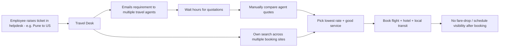
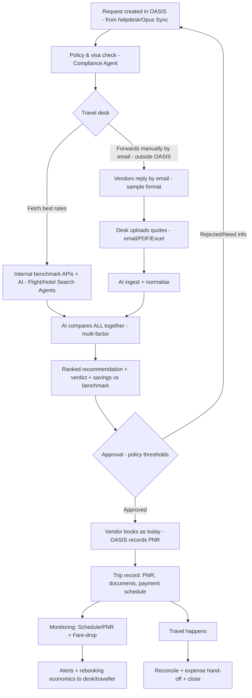
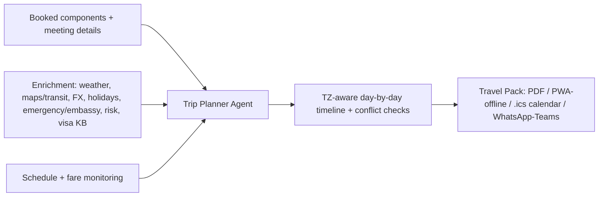
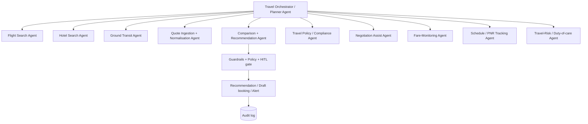
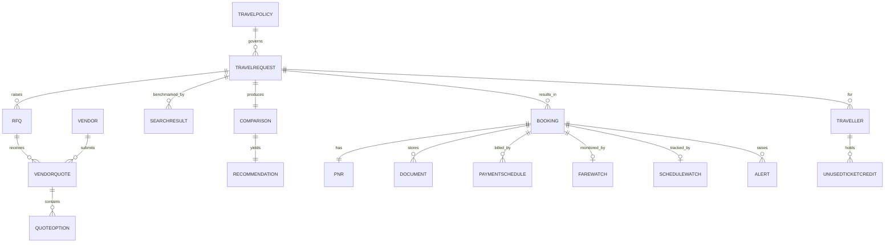

# OASIS — Module 4: AI Travel Desk Agent

### Detailed Module Requirement & Design (for review)

**Parent BRD:** [implementation_plan.md](implementation_plan.md) · §9 Module 4, §8 AI/Agentic Architecture, §11 Integrations, §17 Tech Stack, §18 Phase 4
**Version:** 0.6 (Draft for Review — **flow correction:** vendors have **no API** → request is **created in OASIS** (no electronic RFQ), desk forwards manually, then **Upload quotes** + **Fetch best rates**, AI analyses both together (§1.1, §6, §7-C, D-T5); prior: 0.5 GDS/NDC + benchmarking method, 0.4 Rate-Benchmarking reframe, 0.3 Trip Planner + grounded templates) · **Date:** 2026-06-04 · **Status:** Pending stakeholder review · **Classification:** Internal — Confidential
**Author:** Solution & Design Architect (AI / RAG / Cloud)

> **Scope of this document:** the *what* and *how* of the Travel Desk module — workflows, AI agents, data, screens, integrations, compliance, KPIs, and open decisions. It does **not** build anything yet; it is the design we lock before implementation (Phase 4 in the BRD).

---

## 1. Objective

Replace the manual, multi-hour cycle of **email RFQs → wait for agent quotes → eyeball-compare → cross-check booking sites → book** with a **policy-aware travel workspace** where:

- a travel request flows in from the helpdesk/Opus Sync,
- **AI independently searches the market** (via licensed travel APIs) to produce a **benchmark "best option" + price**,
- **vendor/agent quotations are ingested and auto-normalised** so they compare apples-to-apples against that benchmark,
- the desk gets a **ranked recommendation** (cheapest / fastest / best-value / in-policy) with a transparent comparison sheet,
- the chosen option is **booked by the vendor/TMC as today** (OASIS records it); OASIS then **monitors** schedule changes and **post-booking fare drops**,
- and leadership sees **spend, savings, status and payment schedules** on a clean dashboard.
- after booking, an **AI Trip Planner** assembles the whole trip into a day-by-day **travel pack** — flights, hotel, transit, **meeting schedule**, weather, local transport, and **emergency info** — delivered to the traveller and kept live as plans change (§7-L).

**Turnaround target:** hours → minutes for options; quote comparison effort ≈ eliminated.

> **Primary purpose (Phase 1): a rate-benchmarking & comparison engine — *not* a booking tool.** Today the desk can't tell whether a vendor's quote is high, average, or good. OASIS answers that by pulling **live market fares** and normalising vendor quotes against them, so the desk can **negotiate or pick the best vendor** with confidence. **Booking + support stay with your vendors/TMC (unchanged); in-portal booking is an explicit *future* phase** (§8.1, §21).

### 1.1 Boundary (what OASIS does / does not do)
- OASIS **benchmarks, normalises, recommends, and (post-booking) monitors**. **Phase 1 does not book** — ticketing stays with the **chosen vendor/TMC**, so their support is unchanged; OASIS simply **records** the booking the vendor makes. **In-portal booking** (vendor-API hand-off or direct licensed-API order, always HITL) is a **future phase** (§8.1, §21, D-T2).
- OASIS is **not** a payment system (Finance/ERP remains system of record; see Module 5 for reconciliation) and is **not** an airline/GDS.
- **No scraping** of consumer booking sites (ToS / anti-bot / legal / reliability). Market search is via **licensed APIs** — see §8.
- **No electronic RFQ to vendors.** Current vendors have **no API**, so OASIS does **not** send them requests. The request is **created in OASIS**; the desk **forwards it manually/by email as today**; OASIS then lets the desk (a) **Fetch best rates** via internal benchmark APIs + AI, and (b) **upload the vendors' email/PDF/Excel quotes** — and the AI **analyses both together** to recommend the best option on multiple factors.

---

## 2. How this addresses your stated challenges

| # | Your challenge | OASIS capability | Section |
|---|---|---|---|
| 1 | Manual vendor-quote comparison; need a portal; AI picks best | **Quote Comparison Workspace** + Quote-Ingestion & Comparison Agents (parse → normalise → score → recommend) | §6, §7-C, §10, §13.3 |
| 2 | AI should independently search the internet (layover/time/route) and give a benchmark quote | **Flight Search Agent** over licensed GDS/aggregator/meta-search APIs → OASIS **benchmark option**; shown side-by-side with vendor quotes | §7-D, §8, §10 |
| 3 | Same for hotels | **Hotel Search Agent** + hotel quote normalisation (rate + taxes + location + cancellation + rating) | §7-D, §8, §10 |
| 4 | Track flight schedule by PNR — daily, hourly on travel day | **Schedule/PNR Tracking Agent** with tiered cadence + disruption alerts | §7-G, §12 |
| 5 | Catch **post-booking fare drops** (vendor won't tell us), booking-day → 2 days pre-departure (configurable) | **Fare-Monitoring Agent** + **rebooking economics** (net savings after penalties) | §7-H, §11 |
| 6 | Nice dashboard & reporting (bookings, costs, statuses, payment schedules) | **Travel dashboard + report library + scheduled delivery** | §13.7, §17 |
| 7 | Add market-standard features | Policy engine, duty-of-care, unused-ticket credits, loyalty, negotiated fares, ESG/CO₂, OBT self-booking, expense hand-off | §7-K |
| 8 | Use AI agents wherever best | Full **agent catalog** with HITL gates | §8 |

---

## 3. Current State & Pain Points (as described)



| Pain point | Impact | OASIS fix |
|---|---|---|
| Heterogeneous quote formats; manual normalisation | Hours/request, error-prone, not apples-to-apples | AI parse + normalise to one schema + landed cost |
| No independent price baseline | Can't tell if a vendor quote is competitive | AI market benchmark + negotiation hints |
| Manual multi-site searching | Slow, inconsistent, ToS-risky if scripted | Licensed search APIs via Search Agents |
| No post-booking fare visibility | Money left on the table on fare drops | Fare-watch + rebooking economics |
| Reactive schedule handling | Missed changes, traveller disruption | PNR tracking daily→hourly + alerts |
| No consolidated status/cost view | No leadership visibility, manual reporting | Dashboard + reports + payment schedules |

---

## 4. Guiding Principles
1. **Human-in-the-loop on money/booking** — agents prepare; the desk/traveller confirms purchases (BRD §4.2, §8.1).
2. **Licensed content only** — GDS/aggregator/NDC/meta-search APIs; never scraping (BRD R2, Module 4 compliance note).
3. **Policy-aware by default** — every option is scored against Opus travel policy; out-of-policy needs justification + higher approval.
4. **Transparent recommendations** — always show *why* an option ranked first (price/schedule/policy), with the comparison sheet.
5. **Provider-pluggable** — the travel-content provider is swappable behind an abstraction (like the invoicing extraction provider), so a GDS/aggregator/TMC can change without touching business logic.
6. **One trip record** — flights + hotel + transit + approvals + documents + payments + monitoring, end to end.

---

## 5. Personas & Roles

| Persona | Needs |
|---|---|
| **Traveller / Employee** | Raise request, see options, approve preference, get itinerary + alerts, carry documents |
| **Travel Desk Officer** (primary user) | Run RFQs, compare quotes vs AI benchmark, book, monitor fares/schedules, manage vendors |
| **Manager / Approver** | Approve trip, budget, out-of-policy justification |
| **Department / Cost-Centre Head** | Budget oversight, spend reports |
| **Finance** | Payment schedules, vendor invoice reconciliation (→ Module 5) |
| **Travel Vendor / Agent** (external) | Receive RFQ, submit quotes (portal/email), receive booking instruction |
| **Admin Head / CXO** | Spend, savings, compliance, vendor performance KPIs |
| **System Admin** | Travel policy config, provider/API config, RBAC |

Access via **RBAC + ABAC** (office/region, cost-centre, grade) — e.g., a traveller sees only their trips; the desk sees their office's trips.

---

## 6. End-to-End Workflow



---

## 7. Functional Requirements

### A. Request Intake
- **T1** Travel request from helpdesk ticket / Opus Sync form / chatbot: traveller(s), origin, destination, trip type (one-way/round/multi-city), dates (+ flexible ±days), purpose, **project / service-line / cost-centre**, cabin preference, budget, urgency, special requests (seat/meal/baggage), "needs hotel/transit?", plus the fields the **Opus helpdesk travel template** already carries — **frequent-flyer no, passport & visa, bill-to-client (Y/N), bill-to entity (OSPL/OSSPL/OCSI)**, employee no, mobile, quote due-by (see §7-C.1).
- **T2** **Group/multi-traveller** trips (team travel) under one request.
- **T3** Auto-pull traveller profile from HRMS (grade, home office, passport on file, frequent-flyer numbers, meal/seat prefs).

### B. Travel Policy Engine
- **T4** Policy rules by **grade × distance/duration × region**: allowed cabin, advance-booking window, budget caps, max layover, red-eye rules, preferred airlines/hotels, hotel star/night-rate cap, per-diem.
- **T5** **In-policy / out-of-policy** flag on every option; out-of-policy requires **justification + escalated approval**.
- **T6** **Visa & document check** (→ Module 6): is a visa needed for this nationality→destination? passport validity ≥ 6 months? link/raise a visa case.

### C. Vendor Quotation Management (Challenge 1)
> **Vendors have no API.** The request is **created in OASIS** and **not** sent to vendors electronically — the desk forwards it **manually/by email as today**. OASIS provides two desk-triggered actions on the request: **Fetch best rates** (internal benchmark) and **Upload vendor quotes**; the AI then analyses **both together**.
- **T7** Request **created in OASIS**; OASIS optionally **generates the RFQ email text** (the §7-C.1 template) for the desk to copy & send manually, and tracks the expected vendors + **quote due-by/SLA**. *(No electronic send to vendors.)*
- **T8** **Upload the returned quotes** against the request — vendor **email (`.eml`/`.msg`), PDF or Excel** (per the §7-C.1 sample); multiple vendors, multiple options each.
- **T8.1** **Fetch best rates** — a desk-triggered action runs the **internal benchmark APIs + AI** (TBO/Tripjack + Duffel + Amadeus, §8) to produce OASIS's own market options for the same itinerary.
- **T9** **AI normalisation** of every uploaded quote to a common schema: itinerary (segments, layovers, total duration), **landed cost** (base + taxes + fees + baggage + **agent markup/service fee**), refundability, baggage allowance, cancellation/change rules.
- **T10** **AI analyses uploaded quotes + the fetched benchmark *together*** in one side-by-side **comparison grid** and recommends the best option on **multiple factors** (§10) — with the good/average/high verdict vs the market.

### C.1 Grounded templates (from a real sample in `Data/Travel Desk/`)

> Grounded in a real vendor quote email (a travel-fares agency replying to an Opus helpdesk request, **HYD → SFO**, round trip). `Data/` is git-ignored; the structures below are **representative (traveller PII removed)** and drive the ingestion/normalisation design.

**(i) Opus Travel Request / RFQ — fields Opus sends the vendor** (from the helpdesk work-order):

| Field | Example | Notes |
|---|---|---|
| Request id | 64393 | Helpdesk work-order id |
| Subject / type | Travel – International | Domestic / International |
| Requester / Employee no | *(traveller)* | Who is travelling |
| Service line / Project | SAM – Partnerships | Cost attribution |
| Origin → Destination | HYD → SFO | IATA codes |
| Departure / Return | 13-Jun-2026 / 20-Jun-2026 | |
| Cabin class | Economy | "Kindly share Economy class options…" |
| Seat / Meal preference | Extra-legroom / Non-veg | |
| Frequent-flyer no | *(FF)* | Per airline |
| Bill to client (Y/N) | N | Client-billable? |
| Bill-to entity | **OSPL / OSSPL / OCSI** | Links to paying entity (Invoicing Module 5) |
| Passport & Visa | *(passport)* · B1/B2 | → visa check (Module 6) |
| Quote due-by | 26-May-2026 | Vendor quote SLA |

**(ii) Vendor flight quote — structure returned** (one email, **multiple airline options**; each option = a **multi-segment itinerary + fare + rules**). Representative (1 of 4 options shown):

```
Vendor: Sky Travel Fares — Option 1
Carrier        Flight Class   Date   Day From          To            Status Dep   Arr    Baggage
AI-Air India   1806   Economy 13-Jun  1  Hyderabad     Delhi         HS1    0530  0755   1PC
AI-Air India   183    Economy 13-Jun  1  Delhi         San Francisco HS1    1050  1745   1PC
AI-Air India   184    Economy 20-Jun  2  San Francisco Delhi         HS1    2045  *0545  1PC   (* = arrives +1 day)
AI-Air India   2542   Economy 22-Jun  2  Delhi         Hyderabad     HS1    0940  1200   1PC
Fare - INR 1,28,912/-     Date change - INR 20000 + fare/tax diff   Cancellation - Non-refundable
Refundable Fare - INR 1,44,662/- (2PC)   Date change - INR 15000 + diff   Cancellation - INR 30000 + GST
```
*(Sample carried 4 options — Air India, Cathay Pacific, Emirates, Lufthansa — fares ≈ INR 1.28L–2.90L, with change/cancel rules quoted in **mixed currencies (INR/USD/EUR)** and an optional **refundable-fare variant** per option.)*

**(iii) What the AI must extract & normalise per option (feeds T9 / §10):**
- carrier, flight no, cabin, **segments** (from→to, date, dep/arr **local** times, **+1-day markers** `*` / `#`), **baggage** per segment (1PC/2PC), booking **status** code (e.g., HS1).
- **Derive:** stops & **layovers** from connection cities (e.g., HYD–DEL–SFO = 1 stop via DEL) + layover duration; **total journey time**; outbound/return grouping (Day 1 / Day 2).
- **Fare** + optional **refundable variant**; **date-change** and **cancellation** rules; normalise mixed currencies → **INR (with FX)**; add any agent markup → **landed cost**.

- **T9.1 Template-agnostic extraction (key requirement):** vendors use **different layouts** — table vs prose, varying labels/columns/abbreviations, segments split across wrapped lines, mixed currencies, fare variants. The **Quote-Ingestion Agent maps *any* layout to the canonical schema (§10)** via field-synonym understanding + layout-robust parsing (LLM + Document-AI), **not** a fixed template; it **flags low-confidence fields** for desk review before comparison. *(Most fields are common across vendors — origin/dest, dates, carrier, segments, fare, baggage, change/cancel rules — with "here-and-there" variation the agent reconciles.)*

### D. AI Independent Market Search (Challenges 2 & 3)
- **T11** **Flight Search Agent** queries licensed flight APIs (GDS/aggregator/NDC/meta-search) and returns options reasoning over **price, total travel time, layover count/duration, route, cabin, baggage, refundability, airline rating, on-time record**.
- **T12** **Hotel Search Agent** returns options on **nightly rate + taxes, distance to office/venue, cancellation policy, breakfast, rating, loyalty**.
- **T13** OASIS's best self-found option becomes the **benchmark** — explicitly compared to vendor quotes ("Vendor A ₹95k vs OASIS benchmark ₹88k → negotiate or self-book").
- **T14** **Ground transit** options (airport transfer / cab / car rental) where requested.

### E. Comparison, Recommendation & Negotiation
- **T15** **Ranked recommendation** with selectable lenses: *Cheapest · Fastest · Best value · Most policy-compliant*; transparent scoring (§10).
- **T16** **Savings surfaced**: vs benchmark, vs highest quote, vs policy cap.
- **T17** **Negotiation assist**: draft a message to a vendor citing the benchmark to push for a better rate.

### F. Assisted Booking (HITL)
- **T18** Desk selects an option → routes for **approval** → on approval, **book** via (a) vendor hand-off (record PNR/ticket) or (b) licensed booking API order. **Never auto-purchases without approval.**
- **T19** Capture **PNR, e-ticket, hotel voucher, transit confirmation**, fare rules, and **documents** in the trip record; send **itinerary** to traveller (Email/WhatsApp/Teams).
- **T20** **Payment schedule** captured per booking (advance/deposit, due dates, settled) — links to Invoicing (Module 5) for vendor-invoice reconciliation.

### G. Schedule / PNR Tracking (Challenge 4)
- **T21** Track each booking by **PNR**; poll a **flight-status provider**: **daily** until 48–72h before departure, then **hourly on travel day** (and on-change push). Cadence configurable.
- **T22** Detect & alert: **time change, cancellation, delay, gate/terminal change, equipment change**; suggest action (re-confirm, rebook).

### H. Post-Booking Fare-Drop Monitoring (Challenge 5 — the headline pain)
- **T23** After booking, keep watching the **same/equivalent itinerary** fare via search APIs.
- **T24** Alert the desk when the fare drops **beyond a configurable threshold** (absolute ₹ or %), within a window **from booking day → N days before departure** (default **2 days**, configurable).
- **T25** **Rebooking economics**: compute **net savings = (booked fare − new fare) − change/cancel penalty − fare difference**, considering refundability; recommend rebook only when net-positive. Also flag **vendor claim** opportunities (some vendors honour drops).
- **T26** Log realised **fare-drop savings** for reporting.

### I. Notifications & Comms
- **T27** Multi-channel (Email / WhatsApp / Teams) for: quote-ready, recommendation, approval needed, booking confirmed, schedule change, fare-drop, visa reminder, trip reminders, return reminder. Per-user/channel preferences; full log.

### J. Dashboard & Reporting (Challenge 6) — see §13.7 / §17.

### K. Market-Standard Add-ons (Challenge 7 — proposed)
- **T28 Duty of care / travel risk:** "where are my travellers" map, risk/advisory alerts (weather, strikes, geopolitical), emergency contacts. *(Enterprise must-have.)*
- **T29 Unused-ticket & airline-credit management:** track non-refundable unused tickets and credit shells; apply to future trips (commonly-missed savings).
- **T30 Negotiated/corporate fares & rate-contracts:** preferred airlines/hotels with negotiated rates bias recommendations.
- **T31 Loyalty/frequent-flyer & hotel-program** capture per traveller.
- **T32 Expense hand-off:** push trip costs to the expense/ERP system; reconcile actuals vs estimate.
- **T33 Online Booking Tool (OBT) self-service:** for simple in-policy domestic trips, the employee self-books within guardrails; desk handles complex/international.
- **T34 Carbon / ESG:** CO₂ per trip, greener-option nudges, ESG reporting.
- **T35 Multi-currency / FX** for international trips; **SLA tracking** on vendor quote turnaround; **trip approvals / pre-trip authorisation**; **chatbot** ("book me Pune→Bangalore next Tue").

### L. AI Trip Planner & Travel Pack (beyond booking — the end-to-end trip experience)

**Objective:** once a trip is booked, the **Trip Planner Agent** auto-assembles every component into one coherent, time-zone-aware, day-by-day plan and a deliverable **travel pack** — so the traveller has flights, hotel, transit, meetings, weather, local transport, and emergency info in one place, kept live as plans change.

> **Example.** *Pune → New York; client meeting Monday 10 AM.* The planner produces: outbound flight (with terminals/TZ), JFK→hotel transfer (ETA + leave-by), hotel check-in, a **Monday timeline** ("leave hotel 09:05 for 10:00 meeting — 32 min by cab"), the **weather** for the week, **local transport** options, **emergency/embassy** numbers, visa/doc status, currency/FX, and the return — bundled as a PDF + mobile pack + calendar invites.



- **T36 Itinerary generation:** sequence booked flight/hotel/transit into a **time-zone-aware, day-by-day timeline** (depart → arrive → transfer → hotel → meeting → return), reconciling local times and durations.
- **T37 Meeting alignment & conflict detection:** ingest client/internal meetings (date/time/location/contact); place them on the timeline and **flag conflicts** — flight lands after the meeting, tight connection, hotel check-in after the meeting — with proposed fixes.
- **T38 Local-transport planning:** for each hop (airport↔hotel↔meeting) suggest options (cab / rideshare / metro) with **ETA, estimated cost and a "leave-by" time**; optionally book transfers (HITL).
- **T39 Destination enrichment:** **weather forecast** for the dates (+ packing hint), **time-zone & jet-lag** note, **currency & FX**, **public holidays** (business impact), and **local basics** (language, plug/voltage, connectivity, dress/cultural notes).
- **T40 Safety & emergency pack:** local **emergency numbers**, nearest hospital, **embassy/consulate** (international), the **24×7 travel-desk / duty-of-care hotline**, the traveller's emergency contact, and the current **risk/health advisory** (reuses T28).
- **T41 Documents bundle:** visa status & entry requirements (→ Module 6), passport, e-ticket, hotel voucher, insurance — all attached to the pack.
- **T42 Delivery & live updates:** produce the pack as **PDF + mobile/PWA (offline) + calendar invites (.ics) + WhatsApp/Teams card + email**; the pack **auto-regenerates and re-notifies** when monitoring detects a schedule change or rebooking (T21–T25).

**AI fit:** timezone math, sequencing, conflict detection, a natural-language **trip brief**, and personalisation (traveller prefs/history). The planner **assembles and suggests only** — any transfer booking stays HITL.
**Cost note:** enrichment APIs (weather / maps / FX / holidays / emergency data) are **low-cost** relative to flight/hotel content APIs — high traveller-experience value for small incremental spend.

---

## 8. Travel-Content Sourcing — Compliance & Provider Options

> This is the key call for "AI searching the internet." We meet the intent **compliantly** via licensed programmatic content, behind a **pluggable provider** — exactly the pattern we used for invoice extraction. **Phase 1 only *searches* (to benchmark), so we lead with the cheapest content (free-search / India-B2B); booking content is chosen later.**

**GDS vs NDC — how airline fares reach us:**
- **GDS** (Amadeus / Sabre / Travelport) — the legacy distribution "switchboard"; **broad multi-airline coverage** but plainer content (basic fare classes, limited ancillaries) on older tech. Many **low-cost carriers (LCCs)** — IndiGo, Akasa, etc. — aren't fully in the GDS.
- **NDC** (IATA's modern XML/API standard) — airlines distribute **richer, personalised offers** (branded fares, bundles, bags/seats, dynamic pricing) and often **cheaper or NDC-exclusive fares** that bypass the GDS fee; reached via NDC aggregators (e.g., Duffel). More fragmented; post-sale servicing can be fiddlier.
- **Implication for benchmarking:** no single channel carries *every* fare (GDS, NDC and LCC differ), so OASIS **triangulates across 2–3 complementary sources** and reports a **market range**, not one feed (see §8.1).

**Recommended: licensed APIs, not scraping.** Scraping consumer sites (MakeMyTrip, Booking.com web, etc.) violates ToS, hits anti-bot/CAPTCHA, breaks constantly, and carries legal risk (BRD R2). Instead, the **Search Agents call licensed content** — for benchmarking, prefer **free-search / B2B-aggregator** sources:

| Content | Phase-1 (search/benchmark) — preferred | Booking (future) |
|---|---|---|
| **Flights** | **Duffel** (free search), **Kiwi/Tequila or Travelpayouts** (affiliate/meta), **TBO / Tripjack** (India B2B — full domestic LCC content), **Amadeus Self-Service** (per-call) | GDS/NDC/Duffel order APIs, or vendor/TMC hand-off |
| **Hotels** | Makcorps / Amadeus Hotel Search (per-call); RateHawk / HotelBeds (net) | net-rate book via aggregator/TMC |
| **Flight status / schedule** | *(only when schedule-tracking is enabled — Phase 4b)* AeroDataBox / Aviationstack (self-serve) or Cirium / OAG (enterprise) | — |
| **Visa / travel docs** | Sherpa / IATA Timatic (→ Module 6) | — |
| **Travel risk** | Provider feed (e.g., International SOS / Crisis24) | — |
| **Trip-pack enrichment** | Weather (OpenWeather / Tomorrow.io), Maps & transit (Google Maps / Mapbox), FX, public-holidays, emergency/embassy datasets — all **low-cost** | — |

> **India + International:** lead with **TBO or Tripjack** (the B2B consolidators Indian agents/TMCs use — strongest domestic LCC coverage) **plus one global source** (Amadeus / Duffel) for international/NDC. See cost & support in **§8.1**.

**Booking modes — *deferred to a future phase* (HITL on both when enabled):**
- **(A) Assisted hand-off** — desk books with the chosen vendor/TMC; OASIS records PNR/ticket/cost. *(Lowest effort; matches today.)*
- **(B) Direct API order** — OASIS creates the order via a booking API after approval. *(Most seamless; needs commercial agreement + payment rails + servicing — see §8.1.)*

**Provider abstraction:** a `TravelContentProvider` interface (search, price, rules, order, status) lets us start with one search provider and add/swap others by config — no business-logic change. **→ Open decisions D-T1…D-T3 (§18).**

### 8.1 Cost & Support Model (benchmark-first)

**Cost is negligible for benchmarking** — because Phase 1 only **searches** (no booking), we can use **free-search / B2B-aggregator** providers and pay almost nothing. Indicative (early-2026; *verify on each provider's pricing page — the charging model is the reliable part, exact per-call prices vary by tier/region*):

| Provider | India + Intl coverage | **Search / request** | **Book / order** (future) | Pricing model |
|---|---|---|---|---|
| **Duffel** | Intl strong; India via NDC/airlines (growing) | **Free** (no per-search fee) | ~a few US$/order + ~2.9% if using Duffel Payments | Free search; monetise on bookings |
| **Kiwi (Tequila) / Travelpayouts** | Broad incl. India LCCs (meta) | **Free / affiliate** | You *earn* commission (≈ no cost) | Affiliate / meta-search |
| **Amadeus Self-Service** | Global incl. India (GDS content) | **~$0.01–0.05 / call** (free test tier) | per-order + price calls (higher) | Pay-per-API-call, volume-tiered |
| **TBO / Tripjack** (India B2B) | **Strongest India** + Intl | **No per-search fee** (B2B API) | Net fare + your markup (pay on ticketing) | B2B wallet/credit, net rates |
| **Hotels — Makcorps / Amadeus Hotel / RateHawk** | Global + India | cents/call or net-rate | net + markup | per-call / net-rate |

**At < 100 searches/day (~3,000/month):**
- Free-search / affiliate / B2B (Duffel, Kiwi, TBO/Tripjack) → **≈ $0/month** API fees (only infra + LLM cost).
- Amadeus per-call → **≈ $30–150/month**; hotels add a little.
- **Net: benchmarking is effectively free-to-cheap at this volume.** Flight-*status* APIs (~$30–250/mo) are only needed once **schedule tracking** is switched on (Phase 4b).

**Do TMCs use the same content? Yes.** TMCs/agents price off the **same GDS / NDC / airline-direct + (in India) B2B consolidators (TBO, Tripjack, Akbar, Riya)**. The data is *not* the differentiator — **support is**. So OASIS can benchmark vendors on the very fares they themselves see.

**Support — keep it with vendors/TMC (the hybrid model).** Corporate reissue / refund / disruption ops are genuinely hard; **do not take them on by talking to airlines directly.** Recommended split:
- **OASIS = the intelligence layer** — benchmark, compare, negotiate, and (later) fare-drop & schedule alerts that *catch what vendors miss*.
- **Vendor / TMC = fulfilment + 24×7 support** — unchanged from today.

Escalation as the program matures:
1. **Now:** keep your vendors; use OASIS to steer spend toward the **best-performing 1–2 vendors** (good rates *and* accountable support), benchmarked on every request.
2. **Medium term:** consolidate to **one corporate TMC that exposes an API + a support SLA** — OASIS auto-pulls and benchmarks their quotes, and you get consistent 24×7 servicing + duty-of-care.
3. **Future (only if booking moves into OASIS):** book via a provider that **bundles servicing** (a TMC API, or a B2B aggregator like TBO with a support desk) — **never raw airline-direct** for a corporate program.

**Benchmarking method & starter stack.** No single API returns the absolute lowest fare, so OASIS polls **2–3 complementary sources** and reports a **market range with source labels** — e.g. *"market ₹1.21L–₹1.43L, median ₹1.29L; vendor quoted ₹1.43L = **+11% vs median**, cheapest comparable ₹1.21L (Air India)."* Recommended Phase-1 stack:
- **TBO *or* Tripjack** — India B2B consolidator (best **domestic / LCC** coverage; free to search, needs a B2B account).
- **Duffel** — NDC / international (free search).
- **Amadeus Self-Service** — GDS-content cross-check (cheap per-call, production).
- *(optional)* **Kiwi / Travelpayouts** — meta second opinion.

**"Free search" ≠ "free tier".** Use each provider's **production (live) endpoint** — those fares are real and benchmarkable. A **free *tier* / sandbox** (rate-limited, cached/test data) is for development only and must **not** drive the live benchmark. Caveats the desk should see: **meta** fares (Kiwi) can be OTA/virtual-interline (a signal, not always bookable/serviceable at that price); **B2B net** fares (TBO/Tripjack) may be agent-only; **NDC/airline-direct** is sometimes cheapest — which is exactly why we present the **range + source**, never a single number.

---

## 9. AI & Agentic Design (extends BRD §8.3)



| Agent | Purpose | Key tools | HITL |
|---|---|---|---|
| **Travel Orchestrator / Planner** | Plan trip end-to-end, route to sub-agents, assemble itinerary | sub-agents, policy KB | n/a |
| **Flight Search** | Live flight options; reason over layover/time/route/baggage/refund | flight APIs (GDS/NDC/meta) | No (read) |
| **Hotel Search** | Live hotel options; rate/location/policy/rating | hotel APIs | No |
| **Ground Transit** | Transfers / car rental options | transit APIs | No |
| **Quote Ingestion + Normalisation** | Parse vendor quotes (email/PDF/Excel) → structured + landed cost | doc-AI/OCR, parser | No |
| **Comparison + Recommendation** | Normalise, score, rank vendor + benchmark; comparison sheet | scoring engine | No |
| **Travel Policy / Compliance** | Policy fit, out-of-policy flags, visa/passport needs | policy KB (RAG), HRMS | **Gate** |
| **Negotiation Assist** | Draft vendor negotiation using benchmark | templates, benchmark | No (draft) |
| **Fare-Monitoring** | Post-booking fare watch + rebooking economics | search APIs, jobs | Alerts only |
| **Schedule / PNR Tracking** | Daily→hourly status; disruption detection | status API, PNR sync | Alerts only |
| **Travel-Risk / Duty-of-care** | Risk/advisory alerts, traveller locator | risk feed | Alerts only |
| **Booking (assisted)** | Prepare order / hand-off package | booking API / vendor adapter | **Gate (approval)** |
| **Trip Planner / Itinerary** | Assemble booked components + meetings into a TZ-aware day-by-day timeline + travel pack; detect conflicts; enrich (weather/maps/FX/emergency) | trip record, weather/maps/FX/holiday APIs, risk feed, visa KB | No (assemble/suggest) |

**RAG knowledge:** travel policy, preferred-vendor & rate-contracts, visa rules, destination SOPs, past-trip history (citations for "why this recommendation").
**Model routing (BRD §8.6):** heavy reasoning (planning, normalising messy quotes) → frontier model; high-volume classification/extraction/status → fast/cheap model; cache aggressively.

---

## 10. Quote Normalisation & Scoring Model

**Normalised option schema (flight):** segments[] (carrier, flight no, dep/arr, RBD/cabin, duration), layovers[] (airport, duration), totalDuration, baggageAllowance, refundable?, changeRules, **price = base + taxes + fees + ancillaries + vendorMarkup → landedCost**, currency, fareRules, source (vendor name | benchmark).

**Weighted score (configurable):**

| Factor | Default weight | Notes |
|---|---|---|
| Landed cost | 40% | Lower is better; normalised to currency |
| Schedule quality | 20% | Total duration, layover count/length, red-eye |
| Policy compliance | 15% | In-policy boosts; out-of-policy penalised |
| Refundability/flexibility | 10% | Refundable/changeable preferred for volatile trips |
| Airline/hotel quality | 10% | Rating, on-time record |
| Vendor service/SLA | 5% | Past service rating + quote turnaround |

Output: ranked list + **"why"** chips + the four lenses (Cheapest/Fastest/Best-value/In-policy). Weights tunable per Opus policy.

**Grounded:** this schema is validated against the real sample in §7-C.1 — multi-option email, multi-segment itineraries, fare + refundable variant, mixed-currency change/cancel rules, per-segment baggage, and +1-day arrival markers all map cleanly into `segments[] / layovers / landedCost / refundable / changeRules / baggage`.

---

## 11. Fare Monitoring & Rebooking Economics

- **Window:** booking day → **(departure − N days)**, default **N=2**, configurable per trip/policy.
- **Cadence:** 1–3×/day (configurable); more frequent near threshold.
- **Trigger:** new fare ≤ booked fare − threshold (₹ or %).
- **Net-savings calc:** `net = (bookedFare − newFare) − changePenalty − fareDifference`; consider refund type; recommend rebook only if `net > minSavings`. Surface **vendor-claim** path when applicable.
- **Outcome:** alert desk with the number, the action, and one-click "start rebooking" (assisted) — logged as realised savings.

---

## 12. Schedule / PNR Tracking — cadence

| Phase | Cadence | Watch for |
|---|---|---|
| Booking → 72h before | **Daily** | schedule change, cancellation, equipment change |
| 72h → day of travel | 2–4× day | time shifts, schedule churn |
| **Day of travel** | **Hourly** (+ on-change) | delay, gate/terminal, cancellation |
| In-transit (connections) | event-driven | misconnect risk → rebooking advice |

---

## 13. Data Model (key entities)



**Entities:** TravelRequest, Traveller, TravelPolicy, RFQ, Vendor, VendorQuote, QuoteOption, SearchResult (benchmark), Comparison, Recommendation, ApprovalStep, Booking (type: flight/hotel/transit), PNR, Ticket, Document, PaymentSchedule, FareWatch, ScheduleWatch, Alert, UnusedTicketCredit, Itinerary, CO2Record.

**Trip lifecycle:** `Draft → Submitted → PolicyChecked → Sourcing(RFQ+Search) → Compared → PendingApproval → Approved → Booked → Ticketed → Monitoring → Travelling → Completed → Closed` (+ `Rejected`, `Cancelled`, `Rebooked`).

---

## 14. UI / UX — Screens

1. **Request intake** — guided form (traveller, route, dates, purpose, cost-centre, prefs) + policy hints + visa flag.
2. **Travel desk queue** — all requests by status/SLA; "needs quote / awaiting approval / to book / monitoring".
3. **Quote Comparison Workspace** *(the portal in Challenge 1)* — vendor quotes + **AI benchmark** side-by-side; normalised columns (landed cost, duration, layovers, refundable, baggage, policy, score); lenses; savings; negotiate.
4. **Recommendation & approval** — best option, why, comparison sheet; approve/reject/justify.
5. **Booking** — confirm option → approval → book (vendor hand-off / API); capture PNR/docs/payment schedule.
6. **Trip / itinerary view** — full trip (flights+hotel+transit), documents, timeline, alerts, payment status.
7. **Monitoring board** — fare-watch & schedule-watch with live alerts and rebooking economics.
8. **Dashboard** — operational + cost/savings (see §17).
9. **Reports** — library + scheduled delivery.
10. **Vendor scorecard** — price competitiveness, response SLA, service rating, win rate.
11. **Policy & settings** — policy rules, fare-watch window/threshold, providers, channels.
12. **AI Trip Pack** — generated day-by-day timeline (flights, hotel, transit, meetings, weather, local transport, emergency/embassy, documents) with conflict flags; **export PDF · add to calendar (.ics) · send to WhatsApp/Teams**; offline on mobile; live-updates on schedule change.

---

## 15. Integrations

| System | Purpose | Pattern |
|---|---|---|
| Helpdesk / Opus Sync | Request intake, SSO | REST / deep link / webhook |
| HRMS | Traveller profile, grade→policy, passport/FF | API / sync |
| GDS / Aggregator / NDC | Flight & hotel content + booking | REST / partner SDK / NDC |
| Flight-status provider | PNR/schedule tracking | REST / push |
| Visa/doc provider | Visa rules (→ Module 6) | REST |
| Travel-risk provider | Duty-of-care alerts | feed |
| Email (Graph/IMAP) | Vendor quote ingestion + outbound | Graph / SMTP |
| Finance / ERP / Expense | Payment schedule, invoice reconcile (Module 5), expense | API / feed |
| Notification hub | Email/WhatsApp/Teams | hub |
| Corporate card / BTA | Settlement (optional) | feed |
| Weather / Maps / FX / Holidays | Trip-pack enrichment, transit ETAs & conversions | REST |
| Emergency / embassy data | Safety pack (local numbers, nearest hospital, consulate) | dataset / REST |

---

## 16. API (illustrative)

| Method | Endpoint | Purpose |
|---|---|---|
| POST | `/api/v1/travel-requests` | Create request |
| POST | `/api/v1/travel-requests/{id}/rfq` | Send RFQ to vendors |
| POST | `/api/v1/rfqs/{id}/quotes` | Ingest a vendor quote (parse/normalise) |
| POST | `/api/v1/travel-requests/{id}/search` | Run AI market search (benchmark) |
| GET | `/api/v1/travel-requests/{id}/comparison` | Normalised comparison + recommendation |
| POST | `/api/v1/travel-requests/{id}/approve` | Approve / reject / request info |
| POST | `/api/v1/bookings` | Create booking (assisted/API) — HITL |
| GET | `/api/v1/bookings/{id}` | Trip record + itinerary + docs |
| POST | `/api/v1/bookings/{id}/fare-watch` | Configure fare monitoring |
| GET | `/api/v1/bookings/{id}/status` | Latest PNR/schedule status |
| GET | `/api/v1/reports/{type}` | Report data |
| GET/POST | `/api/v1/travel-policy` | Policy config |

---

## 17. Dashboards & Reports

**Operational dashboard:** open requests by stage, quote-SLA breaches, awaiting approval, upcoming trips, **in-transit today**, live alerts (schedule/fare), this-month spend & savings.

**Cost & savings:** spend by month/dept/cost-centre/route/vendor; **realised savings** (vendor-vs-benchmark, fare-drop, policy); avg ticket price by route; advance-booking compliance.

**Reports (downloadable + scheduled delivery, like Invoicing):** Trip register · Vendor scorecard · Route cost trends · Policy-compliance · **Fare-drop savings** · Schedule-disruption log · Unused-ticket/credit register · Payment-schedule/ageing · CO₂/ESG · Spend vs budget.

---

## 18. Open Decisions (need your input)

| # | Decision | Options | Recommendation |
|---|---|---|---|
| **D-T1** | **Search/benchmark provider** (Phase 1) | Free-search/B2B: **Duffel, Kiwi, TBO/Tripjack (India)**; or per-call **Amadeus Self-Service** | ✅ **Leaning: TBO/Tripjack (India) + Duffel (NDC/intl) + Amadeus Self-Service (cross-check)** → poll 2–3 → **market range**; optional Kiwi/Travelpayouts meta; pluggable. Booking providers chosen later |
| **D-T2** | Booking mode | **Deferred — Phase 1 has no in-portal booking**; later (A) vendor hand-off / (B) direct API order | Keep booking **and support** with vendors/TMC now; revisit once benchmarking proves savings |
| **D-T3** | Flight-status source | GDS PNR sync / Cirium / AeroDataBox / OAG | Choose on coverage + cost |
| **D-T4** | Fare-watch default window & cadence | e.g., until 2 days pre-departure, 2×/day | **2 days, 2×/day**, configurable |
| **D-T5** | Vendor quote intake | Vendors have **no API** → manual forward + **upload** quotes; OASIS adds **Fetch best rates** benchmark | ✅ **Upload + Fetch** (decided) — AI analyses both together; revisit vendor APIs only if/when a vendor exposes one |
| **D-T6** | OBT self-booking scope | None / domestic-in-policy only / broad | **Domestic in-policy only** initially |
| **D-T7** | Build vs TMC partnership | Build on OASIS / integrate a TMC | Build the workspace; integrate TMC/vendors as content+fulfilment |
| **D-T8** | Trip-pack enrichment providers | Weather / Maps / FX / Holidays vendors | Start low-cost self-serve (e.g., OpenWeather + Google Maps + an FX & holidays API) |

---

## 19. Assumptions
- Licensed travel content will be procured (no scraping); at least one flight + one hotel provider available for India↔US.
- HRMS exposes traveller profile (grade, passport, FF); helpdesk can route requests to OASIS.
- Booking stays **assisted/approved** until policy + vendor/commercial agreements permit fuller automation (BRD §4.2).
- Finance/ERP integration for payment schedule + reconciliation (Module 5) is available.
- PII (passport, DOB, FF numbers) handled per BRD §13 — encryption/masking, ACL-aware RAG, consent.

## 20. KPIs
Quote turnaround (hours→minutes) · % quotes auto-normalised · cost savings (vendor-vs-benchmark + fare-drop + policy) · **fare-alert savings (₹)** · policy-compliance rate · schedule-disruptions handled proactively · vendor scorecard (price/SLA/service) · advance-booking compliance · traveller CSAT · unused-credit recovered · **trip-pack adoption** · **on-time meeting arrival (zero itinerary conflicts)**.

## 21. Phasing (aligns BRD Phase 4 — Travel Desk Agent, ~10 wks)
- **MVP (Phase 1 — Rate Benchmarking, no in-portal booking):** request intake → policy check → RFQ to vendors + **AI market-rate benchmark** → quote normalisation & **comparison workspace** (good / average / high verdict + savings) → recommendation + **negotiation assist** → **vendor books as today** (OASIS records it) → **operational + savings dashboard**.
- **Phase 4b:** Schedule/PNR tracking + **post-booking fare-drop monitoring** + rebooking economics + alerts + savings reports + **AI Trip Planner & live travel pack** (§7-L).
- **Phase 4c (add-ons):** duty-of-care, unused-ticket credits, negotiated fares, OBT self-booking, expense hand-off, ESG, chatbot booking, direct-API booking mode.

## 22. Glossary
**PNR** Passenger Name Record · **GDS** Global Distribution System · **NDC** New Distribution Capability · **TMC** Travel Management Company · **OBT** Online Booking Tool · **BTA** Business Travel Account · **RBD** Reservation Booking Designator (fare class) · **SSR** Special Service Request · **Landed cost** all-in price incl. taxes/fees/markup · **Layover** connection stop · **Fare rules** change/refund conditions · **HITL** Human-in-the-loop · **Travel pack** consolidated trip itinerary + essentials (weather, transit, emergency, docs) · **.ics** calendar-invite file format · **LCC** low-cost carrier (e.g., IndiGo, Akasa) · **GDS / NDC** see §8.

---

*End of Travel Desk module design v0.1 (Draft for Review). On your sign-off of the open decisions (§18), I'll lock this and (when you're ready) build it phase-wise with mock data — the same way we did Invoicing.*
